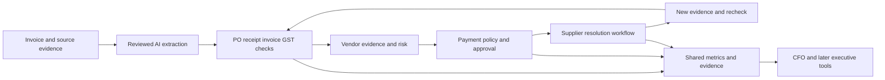
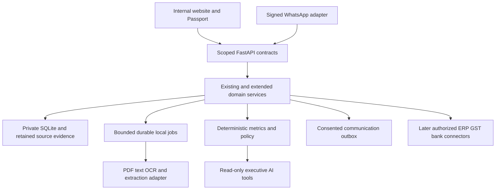

# GSTShield Financial Command Center research and expansion plan

Research date: 6 October 2026. Planning baseline: commit `04b2b42`, the saved Phase 13 checkpoint. This document proposes an expansion; it does not modify the existing eight resource MDs, the supplied documents or the application. Read it with [the team guide](10_TEAM_PRODUCT_AND_JUDGES_GUIDE.md).

## 1. Direction and immediate decision

Build the larger application your team describes: **Invoice upload → AI extraction → four-way reconciliation → vendor risk → payment decision → automated resolution**, followed by an evidence-backed executive command center. Keep the existing GST, cases, payment-proposal, reports, security and local-storage work as its foundation. Extend it through connected modules rather than replacing it with an unrelated dashboard.

The product vision is a financial firewall between a business's suppliers and its payment process. In the first expanded release, the firewall evaluates and routes an internal payment decision. A later authorized payment connector makes those gates enforceable at the payment boundary. This progression allows a substantial useful product now and a credible route to a larger platform.

The immediate work is product learning and scope planning. Phase 14's full regression can stay postponed during this discussion. It remains a release gate before claiming the whole application works reliably, particularly because the Phase 13 record contains an unresolved blank-page/startup failure. No regression is authorized by this planning document. No new code, model installation, provider account, bank integration or repository is created here.

### Reading order

1. Team members read the companion guide first for basic finance and current workflow.
2. Read sections 2–6 here for customer problem, existing code, competitor context and proposed USP.
3. Read sections 7–12 for the expanded six-moment product, architecture and build phases.
4. Use sections 13 onward for acceptance, broader features, research sources and decisions.

### Three horizons

| Horizon | Product outcome | Meaning |
|---|---|---|
| Existing baseline | Saved evidence, GST comparison, review, business actions, cases, proposals and reports | Implemented foundation; Phase 13 provider/full acceptance pending |
| Connected expanded release | All six moments plus dashboard and CFO assistant | New implementation work defined below |
| Larger platform | ERP/GST/payment integrations, multi-entity operations and CEO/COO/CTO/CMO intelligence | Staged extension using the same evidence and permission model |

The full vision is retained. The sequence limits simultaneous integration uncertainty; it is not a request to abandon the larger application.

## 2. Inputs and what was actually examined

- `Hackathon Project Guidelines.pdf`: all three pages. It covers implementation originality, third-party/AI disclosure, technical explanation and jury verification. It does not specify a seven-minute slot or scoring percentages; the demo timing here is a team proposal.
- `GST_Shield_Master_Spec_v2.docx`: complete extracted text and tables, including F01–F36, the ten proposed P0 modules, GrowthOS, architecture, APIs, AI rules, demo, ownership and appendices. The supplied filename says v2; its internal title says Version 3.0 dated 5 October 2026. Treat it as the team's expansion blueprint.
- The pasted financial-firewall/command-center direction and six-moment demo.
- Existing product/build/review resources, the Phase 13 evidence record, installed manifests and targeted code for imports, actions, cases, proposals, reports and channel commands. This is a capability/planning review, not a new line-by-line audit or runtime proof.
- Official product documentation, government guidance and official AI/OCR documentation linked near the relevant claims and in the source register.

Evidence labels throughout: **PRESENT** means source or recorded checks support a local capability; **PARTIAL** means a reusable foundation exists; **NEW** means proposed development; **CONDITIONAL** means external credentials/data/permission or real-provider proof is still needed. A proposed endpoint is never a claim that it exists today.

## 3. The problem worth solving

### 3.1 Follow one invoice through a business

A buyer orders goods or services, receives them, receives a supplier bill, records the purchase, checks the GST evidence, chooses when/how to pay, and later prepares returns and responses. Each step can have a different owner and document. An invoice can be commercially payable while its tax evidence still needs attention. A tax mismatch can persist after someone sends a message. A new source can change an earlier decision. A credit reversal can need later follow-up.

GSTN describes GSTR-2B as a supplier-derived input-credit statement and cautions that other legal conditions can affect credit eligibility. That establishes a real need to compare evidence and retain review decisions; it does not establish that every mismatch causes a permanent loss. [GSTN GSTR-2B FAQ](https://tutorial.gst.gov.in/userguide/returns/FAQ_gstr2b.htm)

Commercial invoice control is also a real software category. SAP documents purchase-order/receipt/invoice matching and exception handling before payment. [SAP receiving and invoice verification](https://learning.sap.com/courses/receiving-purchase-orders-in-sap-ariba-buying-and-invoicing/evaluating-optional-receiving-features)

### 3.2 Specific problems and proposed product response

| Problem | Business consequence | Existing help | Expansion that completes the journey |
|---|---|---|---|
| Supplier invoice missing or different in uploaded GST evidence | Review effort and uncertainty over recorded GST | Missing/mismatch results and retained invoice action | Passport, owner, structured request, correction evidence and re-evaluation |
| Bill differs from ordered or received goods | Overbilling or premature payment risk | Purchase/GST comparison only | PO/receipt/line allocations and four-way result |
| Bill exists only as a PDF or image | Manual entry and transcription mistakes | Structured CSV/XLSX import | Reviewed extraction with field evidence |
| Supplier repeats unresolved issues | Finance cannot easily prioritize relationships | Invoice actions and histories | Explainable vendor evidence profile and trend |
| A GST issue leads to a careless payment hold | A second commercial/payment-timing problem | Payment facts/proposals and MSME cases | Policy decision with conflicting obligations and escalation |
| A message is mistaken for a resolved invoice | Issue disappears from attention before correction | Draft/history and conditional channel delivery states | Resolution state machine that waits for new evidence |
| Reversed credit is forgotten later | Reclaim-review opportunity not followed up | Claim/reversal/filing observations and case workflow | Cross-period lifecycle links and authorized-source watches |
| Executives see disconnected lists | Decisions require repeated interpretation | Internal sections and saved reports | Coherent dashboard and source-backed CFO tools |
| Supplier bank details change without independent verification | Potential payment diversion | No bank-control connector | Later verified bank-change approval and payment gate |

These are workflow hypotheses grounded in documented processes. Their frequency, buyer willingness to pay and competitor inadequacy still need interviews. Do not invent a survey, customer base, loss percentage or market-size number.

### 3.3 First customer and buyer

Start with an Indian SME finance/AP team or accountant who already has accounting software and exported purchase/GST files, but wants a focused exception-to-resolution workflow. The daily user is the accounts/tax reviewer; the approving buyer is the finance controller, owner or CFO. Procurement and operations become useful when PO/receipt evidence arrives.

The first sale is an **additional decision/workflow layer**. Replacing an entire accounting ledger, payroll, CRM or banking application is a much larger undertaking and is not needed to establish the six-moment product.

## 4. What the code already supplies

The current application is a website: React/TypeScript frontend, FastAPI/Python backend and private local SQLite. The backend runs on the PC. There is no selected external database, cloud application server or object-store service. Existing datasets and workflows are not automatically migrated to the friend's proposed PostgreSQL architecture.

| Capability | Status | Useful foundation for expansion |
|---|---|---|
| Local accounts, workspace roles, selected GST registration/period | PRESENT | Every new module uses the same authenticated scope |
| Bounded CSV/XLSX and supported canonical demo data | PRESENT | Reuse mapping, errors and explicit confirmation |
| PDF/image invoice OCR or LLM extraction | NEW | Add reviewed document intake; CSV parsing is not OCR |
| Exact GST comparison, duplicates, fuzzy suggestions, saved human review | PRESENT | Keep deterministic money/matching; suggestions need review |
| PO and goods/service-receipt matching | NEW | Add separate procurement evidence and line allocation |
| Durable invoice business actions and evidence-change tracking | PRESENT | Source refresh changes an action instead of losing its history |
| MSME, Rule 37, Rule 37A, IRN and notice cases | PRESENT | Existing evidence models, review and histories |
| IRN authenticity or live government filing verification | CONDITIONAL | Current format/evidence checks are reusable; trusted verification needs an adapter |
| Payment allocation proposals, approval and exports | PRESENT | Internal proposed amounts; no money transfer |
| General PAY/REVIEW/HOLD/ESCALATE policy evaluator | NEW | Integrate with proposals and due facts |
| Append-only action/case history and private PDF evidence | PRESENT | Reuse evidence rather than creating a second history system |
| Quantified vendor profile/score, four-way Passport, executive dashboard | NEW | Build projections over retained records plus new evidence |
| Local recorded-date reminders and source catch-up | PRESENT | Extend to promises/SLA escalations with persistent jobs |
| WhatsApp linking, signed inbox/outbox and supplier consent | PARTIAL/CONDITIONAL | Local code and focused checks exist; Meta/physical acceptance pending |
| Live automatic GST fetching/filing and bank execution | CONDITIONAL/NEW | External approved contracts and separate acceptance |
| CFO natural-language assistant and CXO agents | NEW | No LLM or executive agents are currently installed |

### Identity and lifecycle detail that affects new design

`ActionService.upsert` retains invoice actions using workspace, registration, period, purchase-document identity, kind and optional case. Changed evidence invalidates a prior outcome and requests review; matching evidence does not silently become legal approval. Keep that behavior.

The present identity is tied to a retained purchase import and scoped period. A different purchase upload or arbitrary later-period GST snapshot is not already a fully linked multi-year invoice lifecycle. Add explicit cross-period evidence relationships for the larger reclaim/resolution product; do not lose original import IDs or relabel a June snapshot as May just to make a demo join work.

Existing proposal approval is useful authorization/version protection. The broader product still needs explicit maker/checker separation, approval thresholds, controlled overrides and execution permissions. A reviewed proposal is not an instruction already executed at a bank.

### Current verification boundary

Phase 13 checkpoint: the initial 29 channel/provider checks passed; an added source-ambiguity check passed separately. The browser run passed 24/25 checks, with one earlier journey opening a blank page; a subsequent rerun failed startup. Full regression was stopped at the user's request. Lightweight lint/syntax/contracts/TypeScript/build checks passed. This document does not replace those facts with a new passing result.

## 5. Competitor research and opportunity

Research checks public primary documentation, not paid accounts or vendor promises independently tested by us. Features may depend on edition, account and deployment. An undocumented feature is **unknown**, not evidence that a competitor cannot do it.

| Product/category | Capabilities documented publicly | What that means for GSTShield |
|---|---|---|
| ClearGST | Purchase/GSTR-2B matching, vendor sharing, pending credit carried into later reconciliations and document history | Reconciliation, persistence and follow-up alone are not an exclusive USP. [Clear product guide](https://docs.cleartax.in/product-help-and-support/clear-finance-cloud/gst-compliance/gstr-2b-vs-pr-recon) |
| Clear finance cloud | Invoice/PO validation, vendor compliance categories and multichannel conversations, including response tracking | Our full direction has competitors; demonstrate the precise workflow and evidence decisions. [Clear FMCG platform](https://www.clear.in/fmcg-solutions) |
| TallyPrime | Book/portal discrepancy groups, reconciliation review and IMS-related workflows | Aim to complement an existing ledger rather than claim accountants have only spreadsheets. [Tally reconciliation](https://help.tallysolutions.com/gstr-2b-reconciliation/), [Tally IMS](https://help.tallysolutions.com/ims-faq/) |
| Zoho Books | IMS inward-supply review/push workflow; document auto-scanning is documented separately | AI intake and GST workflow integration are valuable but not new categories. [Zoho IMS](https://www.zoho.com/in/books/help/gst/ims.html), [Zoho document intake](https://www.zoho.com/en-de/books/help/documents/documents.html) |
| IRIS/Sovos | GST compliance, reconciliation/e-invoicing and wider tax technology | Specialized tax vendors already address these needs; check current product/edition rather than rely on old articles. [Sovos India](https://sovos.com/in/) |
| Masters India | GST product documentation and ERP/GST integration positioning | Another GST automation competitor; detailed resolution/UI capabilities require a demo before comparison. [Masters India documentation](https://docs.mastersindia.co/masters-india-gst-software), [vendor site](https://www.mastersindia.co/) |
| SAP Ariba | Procurement/receipt/invoice matching and payment-related exception controls | Four-way claims need explicit document definitions and actual allocation logic. [SAP receiving course](https://learning.sap.com/courses/receiving-purchase-orders-in-sap-ariba-buying-and-invoicing/evaluating-optional-receiving-features) |
| GST portal IMS | Recipient invoice actions over supplier-reported evidence | GSTShield can coordinate internal ownership/evidence alongside authorized portal work. [GSTN IMS manual](https://tutorial.gst.gov.in/downloads/news/draft_manual_ims.pdf) |

An old vendor help page can remain indexed long after a workflow changes. For example, search still returns historical GSTR-2 filing help. Use current IMS/product documentation for feature comparisons and official GST material for law. Marketing performance/accuracy percentages are not our measurements.

### 5.1 Candidate gaps to investigate, not fabricated competitor absences

| Candidate opportunity | Why useful | What must be proved |
|---|---|---|
| Evidence coverage visible before every decision | People can distinguish verified, uploaded, stale and unknown conditions | Users make fewer mistaken assumptions than with their current workflow |
| One invoice narrative joins tax and commercial controls | Explains why an invoice can be payable but tax review remains open | Faster reviewer comprehension and better handoff |
| Explicit conflict between GST concern and payment timing | Avoids a simplistic hold that creates another risk | Expert-approved policy and accurate recorded facts |
| Lightweight local deployment over existing exports | Suits a team that cannot start with a new hosted ERP | Installation effort, privacy fit and actual willingness to use it |
| Resolution evidence gates across source revisions | A supplier promise is tracked without calling it correction | Fewer forgotten cases and correct invalidation after new evidence |
| Executive answers that reproduce dashboard numbers | Makes AI useful for decisions without letting it own arithmetic | Every answer references the exact permitted data snapshot |

We have not established that these are absent from Clear, SAP, Tally, Zoho or others. The opportunity is to deliver a focused, understandable package for a chosen buyer and validate the experience.

## 6. USP and positioning to build toward

**Proposed USP:** an evidence-backed invoice decision and resolution workspace that connects commercial receipt, GST uncertainty, payment review and supplier correction, then presents the same traceable facts to management.

The stronger demonstration is a loop: the system sees a missing fact, explains the money/context, chooses the permitted next action, performs an authorized workflow step, watches for new evidence and re-evaluates. It keeps unknown evidence and conflicting obligations visible. The unique value must be demonstrated through this experience, not asserted from a feature list.

### USP candidates with proof requirements

1. **Invoice evidence passport:** one page joins the six moments, sources and history. Prove a new reviewer can explain the issue and next action without finding five screens.
2. **Conflicting-risk decisions:** the same invoice can require tax review and urgent payment review. Prove the policy explains both and does not blindly hold the invoice.
3. **Closed-loop resolution:** request → delivery fact → promise → new source → recheck → reviewed outcome. Prove a message alone cannot clear the issue.
4. **Evidence-first executive AI:** a CFO answer links to the exact records and reproduces the dashboard total. Prove stale/access-denied data cannot be narrated as current.
5. **Local-first adoption:** exports, retained context and optional local AI before expensive connectors. Prove actual setup and runtime requirements on the demo PC.
6. **Cross-period credit memory:** original claim, reversal, later evidence, reviewed reclaim and filing observation remain distinct. Prove correct linkage without duplicated credit.

These are product differentiators to implement and validate, not claims of a patented algorithm or exclusive market capability. Reconciliation, WhatsApp, AI extraction and PDF export are supporting capabilities, not the moat by themselves.

### What a generic AI chat can and cannot replace

A chat model can read files, explain discrepancies and draft requests. A tool-enabled agent can also automate parts of a workflow. GSTShield's advantage must therefore be its durable permissions, evidence identities, arithmetic, approvals, delivery/uncertainty accounting and repeatable outcome tracking. Sell the integrated operational system; do not claim that AI is inherently unable to perform automation.

## 7. The six connected moments in implementation detail

The common thread is a retained invoice identity, scoped organization/GST registration, source versions, actor and correlation ID. Every screen and automation must use that identity. The flow ends with a recorded outcome and management answer, not a new disconnected feature page.

### 7.1 Invoice upload and AI extraction

**User:** accounts executive. **Trigger:** a supplier PDF/image arrives. **Outcome:** reviewed structured invoice fields with source evidence, ready for the existing comparison engine.

Keep current CSV/XLSX imports. Add PDF/JPEG/PNG intake as a new document adapter, preserving original bytes, hash, uploader, organization, registration and time. Extract native PDF text first; use bounded OCR for image-only pages. A model proposes typed fields from that text, and a deterministic validator checks GSTIN shape, date, document type, components, totals and allowed currency.

Every field carries value, source page/text location, extraction method, model/version where relevant, and review state. Missing or conflicting fields are unknown and remain editable in a confirmation preview. OCR confidence and model self-reported confidence are different; neither is an established probability that the invoice is genuine.

**Screen:** original page alongside proposed fields, low-quality/missing facts highlighted, totals difference visible, Confirm/Edit action. Record an edit as a new event with old/new value and actor. Preserve original extraction for audit.

**Automation:** intake → parse/OCR → structured proposal → validation → ready-for-confirmation job notification. Confirmation remains explicit before evidence enters financial decisions. Model failure leaves the original document and allows manual entry or structured import.

**First scope:** INR invoices, a few supported sample layouts and bounded pages. Choose limits after a PC measurement, initially keeping the existing file-byte ceiling. Add separate page/pixel/time/RAM budgets. Large zip expansion, malicious PDF text and an invoice containing “ignore previous instructions” must not affect tools or permissions.

**Acceptance:** duplicate callback/upload produces one intended document; extraction never invents an unreadable tax amount; an edited field retains provenance; totals remain exact; restart resumes safely; the source cannot be fetched by another workspace.

### 7.2 Four-way reconciliation

For this product, define the four documents explicitly: **purchase order, goods/service acceptance, supplier invoice and GST evidence**. Some AP products use “four-way” to mean adding an inspection document; the team should name our documents rather than rely on an ambiguous industry label. [Clear explanation of matching variants](https://www.clear.in/s/automated-invoice-matching)

Add PO and receipt/service-entry import contracts. The existing purchase register remains accounting evidence, not a substitute pretending to be a PO or receipt.

| Dimension | Check | Output |
|---|---|---|
| Commercial identity | Supplier/recipient, PO reference, invoice identity/document type | Match, conflict or evidence missing |
| Ordered terms | Item, quantity, unit price, approved charges/discounts | Exact difference and rule/tolerance version |
| Receipt/acceptance | Approved delivered quantity or accepted service | Allocation and outstanding evidence |
| Invoice arithmetic | Taxable/components/charges/rounding/gross | Exact validated amount or error |
| GST evidence | Uploaded/authorized source identity, period, values and snapshot | Matched/suggested/missing/mismatched/unknown |
| Source status | Version, freshness, applicability and supersession | Current, historical or recheck required |

Although there are four source groups, multiple dimensions are needed to explain the decision. Return per-dimension reasons and source IDs, not one unexplained green badge.

Handle one PO with several receipts/invoices, partial deliveries, returns/credit notes, services without a physical GRN, and non-PO purchases. Track cumulative allocations so one receipt or GST row cannot satisfy several invoices twice. A configured non-PO policy may mark a dimension not applicable; missing required receipt evidence remains unknown. Unit/currency conversions need an explicit contract before activation.

Retain the existing exact-money and one-to-one GST matching protections. Fuzzy suggestions help a reviewer find candidates; materially conflicting value/identity cannot become a pass because the string score is high.

**Automation:** confirmed input/change → relevant dimension recomputation → new result/version → dependent vendor/policy/metrics invalidation. Reuse retained invoice identity; a retry cannot duplicate allocations.

**Acceptance:** clean, missing GST, partial receipt, price mismatch, duplicate and non-PO cases have stable expected results; source replacement invalidates prior approvals; two invoices cannot consume the same quantity/credit unnoticed.

### 7.3 Invoice Passport and vendor risk

The Passport is the primary story page, not another financial ledger. It presents original source, extraction/review, four source checks, recorded GST amount requiring attention, vendor profile, decision, owner/due item, supplier communication, resolution and evidence timeline.

Build it as a coherent read projection over existing domain records plus new modules. Return an `as_of` time and the versions/source signature represented. Link history to the existing action/case events instead of copying them to a competing timeline store. Initially show unavailable PO/receipt/AI fields as pending features; activate them as their modules ship.

**Vendor profile:** observed invoice count, current issues, recorded unresolved GST amount, duplicate/IRN/receipt exceptions, source coverage/freshness, observed correction duration and promise performance. A vendor with one uploaded invoice should not look as well measured as one with ninety.

If using a 0–100 score, name it consistently as a **risk index** where higher means more recorded concern, or a **trust score** with the inverse direction. Choose one. Store formula version, weights, contributing facts, sample size, calculation time and coverage. Thresholds are company/demo policy, not an official credit rating or learned fraud probability.

A useful initial score groups independent factors: recurring confirmed discrepancies, unresolved recorded amount, overdue promises and evidence gaps. Avoid scoring the same mismatch repeatedly as missing GST, open action and delayed resolution without explaining correlation. A changed source that is still awaiting review updates the facts, not an invented historical correction date.

**Automation:** material source/outcome change recomputes affected vendor profile; its decision inputs are versioned and downstream approvals become stale when relevant inputs change.

**Acceptance:** every score component drills to permitted invoices; unknown facts remain unknown; old/new scores identify their formula versions; a supplied correction changes the relevant component predictably. Provide a small-sample/coverage label.

### 7.4 Payment decision and financial firewall

**User:** AP preparer and finance approver. **Output:** reproducible recommendation/approval state linked to proposed payable amounts. This is the moment where tax, commercial and operational evidence meet.

Recommended states: `READY_FOR_APPROVAL`, `REVIEW_REQUIRED`, `HOLD_UNDER_POLICY`, `ESCALATE`, `APPROVED_FOR_EXECUTION`, then later connector-specific execution states. Friendly PAY/HOLD/REVIEW/ESCALATE labels may accompany them, but approval and money movement must remain separate facts.

Inputs: four-way results, exact outstanding invoice balance, recorded supplier classification/acceptance/payment facts, vendor index and coverage, dispute status, company thresholds, rule version/effective dates and permitted approver. Unknown important facts normally produce review, not an inferred pass.

| Situation | Useful initial policy outcome | Reason |
|---|---|---|
| Commercial evidence complete, arithmetic valid, no required unresolved rule | Ready for approval | Finance still authorizes the proposal |
| GST source missing but payable/receipt evidence present | Review | Decide tax/commercial treatment with complete context |
| Required receipt or approved PO evidence absent | Review or company-policy hold | Avoid approving an unsupported payable |
| Duplicate/overallocated invoice | Escalate | Prevent a duplicate internal approval |
| Payment due for an applicable small supplier while tax concern remains | Urgent review | Reconcile conflicting obligations rather than blindly delay |
| Supplier bank change awaiting independent verification | Block execution pending approval | Verified beneficiary is needed for a bank instruction |
| Source, rule or vendor input changed after approval | Approval stale | Re-evaluate before proceeding |

There is no universal “missing GST means withhold the tax component” rule. The policy must model the commercial amount due, evidence, timing and legal review. Rule 37 concerns buyer non-payment; Rule 37A concerns a supplier-return-related reversal/re-availment lifecycle. They are distinct. [Notification 26/2022](https://gstcouncil.gov.in/sites/default/files/2024-05/ct26-2022.pdf)

MSMED payment timing depends on covered supplier status and acceptance/agreement facts; a configured 45 days is not a universal invoice-date default. Income-tax references also need their applicable tax year because the new Act took effect in April 2026 with transition provisions. [MSMED Act](https://www.indiacode.nic.in/bitstream/123456789/5872/1/a2006-27.pdf), [Income Tax Department transition FAQ](https://www.incometax.gov.in/iec/foportal/help/all-topics/e-filing-services/objective-and-scope-new-act-faq)

Store the decision's complete input/version signature, reasons, affected amounts, next review condition and required permission. An override records actor, reason and before/after state; maker and checker are distinct for payment execution and sensitive bank/policy changes.

**Automation:** evidence update triggers re-evaluation and an approval task. An AI assistant may explain reasons or prepare an internal request; the rule evaluator and authorized people own financial decisions. Actual execution later requires an approved payment connector; bypassing the app through an external bank channel is outside a local advisory gate.

**Acceptance:** same facts/rule version produce same output; outstanding balance cannot be exceeded; unknown receipt/MSME/bank evidence is visible; changed inputs invalidate approval; unauthorized/self-approval is rejected where maker/checker is required.

### 7.5 Automated resolution

This is the biggest completion step for the six-moment story. Automation coordinates the work; a supplier or authorized external system still supplies the correction.

Use separate facts for workflow state, delivery state, supplier assertion and corrected evidence:

`DETECTED → ASSIGNED → REQUEST_PREPARED → SEND_AUTHORIZED → WAITING_FOR_SUPPLIER → PROMISE_RECORDED → NEW_EVIDENCE_RECEIVED → RECHECK_REQUIRED → READY_FOR_REVIEW → REVIEWED_RESOLVED / ESCALATED`.

Some paths skip a promise; delivery failures return to an actionable send/review task. A user's reviewed closure is stored through existing outcome rules. Tax-filing/reclaim completion needs its own observed submission evidence.

**Automate:** compose requests from exact reason codes/values; schedule permitted reminders; record replies as assertions; extract proposed promise dates; detect missed promises; attach new source evidence; rerun affected checks; update Passport/profile/policy/metrics; create the correct review task; preserve outcomes and errors through restart.

Use the existing WhatsApp consent/outbox/delivery boundary. Add templates or other channels only after their actual permitted provider setup. A 24-hour free-form reply window is not an always-on outbound scheduler. Outside the permitted window, show the blocked reason or use an approved template; do not silently claim a reminder was sent.

A simulation adapter can support an offline demonstration, but its label and source provenance stay visible. It may supply a synthetic reply/correction through normal application APIs; it must not edit the live database behind the screen or pretend to be a GST response. Supplier free text is not a command to approve a payment or mark credit recovered.

**Acceptance:** duplicate evidence/messages yield one intended effect; promises do not close an issue; repeated jobs do not spam; source correction rechecks the actual invoice; stale/foreign evidence cannot resolve it; a restart preserves the next task; ambiguous sends remain uncertain rather than automatically repeated.

## 8. Dashboard and executive intelligence

### 8.1 Shared metrics before chat

Dashboard, Passport, exports and CFO answers must query the same metric service/snapshot. Metrics carry organization/GSTIN/period filters, `as_of`, source IDs, coverage, source-current state and formula definition. Never add different kinds of rupee amounts into an unexplained single “money saved” card.

| Metric | Definition | Evidence needed |
|---|---|---|
| Recorded GST under review | Deduplicated source tax amount for current unresolved invoice conditions | Original invoice and active condition; unknown tax shown separately |
| Payment amount requiring review | Outstanding balance of proposals currently requiring that decision | Latest balance and decision signature |
| Current open exceptions | Distinct retained actions/cases, with kinds broken out | Stable identities; avoid counting one invoice repeatedly |
| Evidence-confirmed corrections | Exceptions whose relevant source discrepancy changed and reviewer accepted outcome | Before/after source and outcome |
| Actual credit reclaimed | Recorded filed reclaim supported by the defined submission evidence | Separate from a candidate or matching invoice |
| Actual payment controlled | Executed/blocked connector operation with a recorded final outcome | Payment connector evidence, not a recommendation alone |
| Resolution duration | Defined opening-to-reviewed-outcome interval | Timestamp coverage; separate waiting time and review time |
| Operational health | Queue age, last successful checks, provider/model failures | Real job/channel events |

For the first expanded demo, the strongest honest hero cards are recorded GST under review, payment review amount, unresolved actions and correction outcomes. A later proven outcome can justify a protected-value metric with a precise definition.

### 8.2 CFO assistant

Support five initial questions: What needs review today? Which suppliers contribute most unresolved recorded GST? Why is this invoice in review? Which promises are overdue? What changed after the new source?

Server tools return scoped structured metrics and evidence IDs. The model formats/explains those facts. Amounts and statuses come from the backend and are inserted/validated against the structured result. Each answer includes snapshot, scope, source links and next permitted action. Unsupported cash/profit/forecast questions return the missing data needed.

Start read-only. Later actions create a typed proposal requiring preview/approval and an idempotency key; they do not directly issue model-authored SQL, payments or filing. Retrieve only the current user's permitted organization. Recheck permission/version immediately before any command.

**Acceptance:** five seeded answers exactly match dashboard amounts; one foreign-workspace question discloses no facts; stale sources are labeled; an injected invoice instruction cannot choose another tool; model failure produces a clearly labeled deterministic metric response.

### 8.3 The larger GrowthOS vision

All executive roles share the same evidence graph, but their data and permissions differ. Build actual tools, not six renamed copies of the same chatbot.

| Role | Useful decisions | Additional evidence/data | Staged availability |
|---|---|---|---|
| CFO | Tax-review priorities, payable approvals, working capital | Current AP/GST; later balances, receivables and cash feeds | First executive toolset |
| CEO | Vendor concentration, financial/operational exposure and company priorities | Multi-unit aggregates and genuine business KPIs | After coherent multi-entity metrics |
| COO | Delayed receipts, supplier promises, procurement continuity | PO/receipt/service acceptance and delivery performance | After four-way and resolution modules |
| CTO | Job/backlog/model/provider health and integration incidents | Operational telemetry and connector status | Early observability view; no invented integration health |
| CMO | Campaign contribution, revenue quality and margin decisions | CRM, campaign/ad spend, sales, returns and cost attribution | Later connector-backed module |
| Procurement | Approved suppliers, recurring exceptions and alternatives | Vendor master, delivery, price and approved alternatives | After supplier/profile data |
| Tax reviewer | Explain discrepancy, reversal/reclaim and next evidence | Cases, policy sources and reviewed observations | Reuse existing cases and CFO explanation boundary |

The CMO module belongs in the full plan, but purchase/GST records alone cannot answer campaign ROI. Build its ingest/attribution contract before its agent. No external message, advertisement spend or executive instruction is performed without the corresponding permission and approval workflow.

## 9. Full feature inventory mapped to the friend's blueprint

The feature IDs below preserve the supplied F01–F36 inventory. Status describes the current baseline, not the ambition. Delivery groups are the proposed extension phases in section 11.

| ID | Feature | Baseline | Planned work / delivery |
|---|---|---|---|
| F01 | Document ingestion and AI extraction | Structured imports present; OCR/LLM new | Phase 16: reviewed PDF/image adapter |
| F02 | Four-way PO/receipt/invoice/GST | Two-source GST comparison present | Phase 17: PO/receipt contracts and allocation |
| F03 | Invoice Passport | Related records exist in different views | Phase 15 projection; integrate every later module |
| F04 | Vendor Trust Score | New | Phase 18: observable factors, version/coverage and profile |
| F05 | ITC-at-risk engine | Recorded GST exposure and cases present | Phase 18: deduplicated metrics; distinguish review from legal outcomes |
| F06 | Smart Payment Firewall | Proposals/approval present | Phase 19: rule decisions/conflicts/overrides; Phase 23 execution connector |
| F07 | Vendor Resolution Autopilot | Actions, drafts, history and conditional outbox present | Phase 20: promises, evidence recheck and escalations |
| F08 | GrowthOS CFO Copilot | New | Phase 21: scoped read tools and verified amounts |
| F09 | Executive command dashboard | Internal business screens present | Phase 15 baseline metrics; 18/21/24 expansion |
| F10 | Append-only audit | Action/case/run review events present | Extend existing event model in every phase; coherent correlation |
| F11 | IMS Copilot | Local review; no authorized portal action | Phase 22 recommendation queue; 23 authorized adapter |
| F12 | Fraud/anomaly graph | Duplicate/mismatch signals partly present | Phase 22 evidence-linked relations; verified bank data later |
| F13 | Evidence Vault/case bundle | Private PDFs and cases present | Phase 15 navigation; 20 richer linked evidence bundle |
| F14 | Policy Rules Console | Backend policies/snapshots partly present | Phase 19 versioned tested activation and replay |
| F15 | MSME Payment Clock | Classification/acceptance/payment facts and case review present | Phase 19 policy conflict and explicit applicability/data coverage |
| F16 | IRN/reporting monitor | Format/applicability facts present | Phase 22 versioned applicability/time rules; 23 trusted verification |
| F17 | Duplicate/split invoice detection | Duplicate GST candidates present | Phase 17 allocation safety; 22 splitting/anomaly rules |
| F18 | Multi-GSTIN command center | Scoped registrations/workspaces present | Phase 24 permitted aggregation without tenant leakage |
| F19 | Supplier self-service portal | Consented WhatsApp recipient proof present | Phase 20 controlled correction link; later dedicated supplier portal |
| F20 | HSN/tax-rate validation | New master-data validation | Phase 22 reviewed effective-dated master/adapters |
| F21 | Notice/response assistant | Notice cases/checklist/private PDFs present | Phase 21 evidence-grounded internal drafting; 23 actual authorized submission |
| F22 | Cashflow optimizer | Proposals and recorded paid balances present | Phase 24 needs true cash/receivable/due inputs |
| F23 | Financial Digital Twin | New | Phase 24 assumption-labeled scenarios, not invented forecast accuracy |
| F24 | CEO Agent | New | Phase 24 organization metrics and concentration |
| F25 | COO Agent | New | Phase 24 procurement/receipt/resolution tools |
| F26 | CTO Agent | Readiness/job information partly present | Phase 22 telemetry tools; 24 executive view |
| F27 | CMO Agent | New; marketing data absent | Phase 24+ CRM/ad/sales attribution contract before answers |
| F28 | Tax/Compliance Agent | Domain reasons/cases present | Phase 21 scoped explanation; effective sources |
| F29 | Procurement Agent | New | Phase 24 supplier/delivery/approved-alternative evidence |
| F30 | Multi-IRP failover | No live IRP integration | Phase 23+ supported accounts, idempotency and health proof |
| F31 | Tally/Zoho/SAP connectors | Manual supported exports only | Phase 23 incremental authorized ingest; write-back separate |
| F32 | Bank/payment rail | New; no real execution | Phase 23 sandbox, beneficiary verification, maker/checker and uncertainty handling |
| F33 | Authorized GST/GSP integration | No production integration | Phase 23 contracts/consent/permissions and submission receipts |
| F34 | Role-based maker/checker | OWNER/REVIEWER/VIEWER plus proposal approval present | Phase 19 actor separation and thresholds; 24 executive scopes |
| F35 | Notifications/SLA | Local due monitor and conditional WhatsApp present | Phase 20 promise/escalation scheduling; provider gates |
| F36 | Analytics/outcome telemetry | Saved results/history and measured local benchmarks present | Phase 18 metric definitions; 22 outcome/performance telemetry |

F01–F10 form the proposed expanded connected release; existing pieces are reused. F11–F36 extend the full product in subsequent slices. The friend's P0 labels are a target release definition, not evidence that ten large modules can safely be completed in one session or two days.

## 10. Architecture and technology without an unnecessary rewrite

### 10.1 Keep the current local modular application

Retain React/TypeScript, generated API contracts, FastAPI/Pydantic, private SQLite, exact-money domain rules and bounded local workers. Retain current dependency lockfiles. New modules use the existing authentication, scopes, quota/capacity checks, errors, source-current/version checks and request receipts.

Add domain/service modules for document extraction, procurement matching, vendor evidence, policy decisions, resolution and executive metrics. Their data relationships refer to existing source/import/run/result/action/case/proposal/artifact IDs. New records are additive and retain provenance; any schema change uses an explicit validated/backed-up upgrade. New features can require new tables, but do not require a wholesale database migration or silently rewritten old records.

No event broker, Redis, microservice split, hosted database or new orchestration framework is selected for this local release. Commit an event and its local effect within the applicable transaction; external effects use an outbox. Process heavy extraction/LLM work outside database locks. An invoice update invalidates affected projections/approvals using source signatures instead of forcing every screen to recompute unrelated data.

### 10.2 Practical local AI/extraction option

| Component | Recommended first evaluation | Why / gate |
|---|---|---|
| Native PDF text | pypdf in the extraction adapter | Already a development dependency; move to required runtime only when used. It is not OCR. [Official text extraction guide](https://pypdf.readthedocs.io/en/stable/user/extract-text.html) |
| Scanned documents | Tesseract behind a bounded local adapter | Local OCR, Apache-2.0 engine; benchmark actual layouts and Windows packaging. [Official manual](https://tesseract-ocr.github.io/tessdoc/) |
| Local model serving | Optional Ollama on loopback | Structured JSON-schema responses fit typed field proposals and explanations. [Official structured outputs](https://docs.ollama.com/capabilities/structured-outputs) |
| Initial text-model candidate | A small instruction model; evaluate Qwen3-4B-Instruct-2507 as one candidate | Official model card identifies the license; quality/speed/RAM on this PC are not yet measured. [Qwen model card](https://huggingface.co/Qwen/Qwen3-4B-Instruct-2507) |
| Validation | Existing Pydantic and deterministic domain rules | JSON shape success does not establish field correctness |
| PDF/evidence output | Existing report service/ReportLab | Preserve current private artifact behavior |
| Similarity | Existing RapidFuzz candidate matching | Reuse rather than add an unnecessary model/vector database |

This is a researched evaluation path, not a completed dependency selection/installation or promise that a particular model fits the laptop. Before pinning: record OS/Python compatibility, license, model hash/quantization, peak RAM, cold start, five-question latency, extraction accuracy and failure behavior. Freeze tested versions in the lockfile; do not replace the current stack based solely on a new marketing recommendation.

Local inference avoids a mandatory per-request API bill, but model download, RAM, CPU/GPU and electricity still exist. WhatsApp/ERP/GST/payment provider costs are separate. If local inference cannot meet the demo budget, the team can choose a separately consented hosted model; private invoices/contacts must not be uploaded automatically. A deterministic fallback remains labeled as a fallback, not fake live AI.

### 10.3 Minimal new data contracts

Proposed additions: document/extraction draft with field evidence; PO/receipt and allocation; vendor profile/version; policy definition/evaluation/approval; resolution promise/task; coherent metric snapshot; executive query/source record; connector consent/cursor/receipt. A logical addition can be a few tables or a projection over existing ones; it is not a requirement to duplicate every entity name in the friend's diagram.

Required common fields: organization/workspace, registration and applicable periods, stable invoice references, source/provenance/hash, actor/time, expected version, current/historical state and operation/correlation ID. Money stays explicit INR decimal strings/minor units with documented conversion, never ambiguous bare numbers or model-generated arithmetic.

For cross-period lifecycle, separately retain invoice/claim period, source-reporting period, observation time, reversal/reclaim period and supersession. Link by validated recipient/supplier/document identities and reviewed ambiguous candidates. One invoice can have many observations but cannot have duplicated claimed/reclaimed balance.

### 10.4 Proposed API groups

These are planning names under `/api/v1/workspaces/{workspace_id}`; finalize them with generated contracts at implementation time.

- `/documents` and `/documents/{id}/extraction`: source intake and draft review.
- `/purchase-orders`, `/receipts`, `/invoices/{id}/commercial-checks`: procurement evidence and allocations.
- `/invoices/{id}/passport`: coherent read projection over retained facts.
- `/vendors/{id}/evidence-profile`: current profile with score version/coverage.
- `/policy-decisions`, `/policy-decisions/{id}/approvals`: evaluated internal controls, expected versions and actor separation.
- `/resolution-tasks` and `/resolution-tasks/{id}/promises`: workflow progress and new evidence.
- `/dashboard/summary` and `/executive/queries`: scoped metrics/tools and source-backed answers.
- `/connector-consents` and `/connector-jobs`: later provider activation/receipts.

Reuse existing case/action/proposal/report/channel commands wherever their semantics fit. Do not create `/cases` v2 or an invoice root disconnected from retained purchase documents just to mirror the Word file.

### 10.5 Security and operational properties for every addition

Document text and supplier messages are untrusted input. They cannot change tool permissions, queries, beneficiaries, policy versions or financial approvals. AI never chooses arbitrary SQL, URLs or executable code. Backend tools scope all reads by current live membership; validate returned evidence IDs and reference versions.

Apply byte/page/pixel/archive/time/RAM quotas to document work; one bounded inference/extraction task at a time until measured. Keep browser secrets out of storage/bundles. Model/provider outages leave original core workflows usable. Return actionable failed/pending states instead of invented success.

For external payment/GST actions, distinguish prepared, approved, attempted, acknowledged, completed, failed and unknown. Reserve an idempotent instruction before transmission; do not automatically repeat an uncertain money transfer or tax submission. Reconcile using actual provider receipts/status contracts. No app-side approval can establish the legal truth of an uploaded document.

## 11. Proposed extension phases and delivery gates

These are proposed phases **15–24**, following the existing 1–14 plan. They are not marked started and do not rewrite 05. Phase 14 remains the baseline combined verification/rehearsal gate. The user can postpone its full run during planning; a release still needs an authorized verification pass.

| Phase | Deliverable | Depends on | Demonstrable gate |
|---|---|---|---|
| 15 | Invoice Passport and coherent baseline dashboard | Existing scoped services | One invoice joins source/result/action/case/proposal/report; exact metrics drill down |
| 16 | Reviewed document AI extraction | 15 source identity and confirmation contract | PDF/image → proposed fields → edit/confirm → existing import flow |
| 17 | PO/receipt/invoice/GST matching | 16 retained invoice draft; existing GST engine | Four named source groups; partial/duplicate allocations and missing evidence handled |
| 18 | Vendor evidence/risk and money intelligence | 17 and existing histories | Vendor drivers and dashboard/Passport totals use one snapshot |
| 19 | Versioned payment decisions and maker/checker | 17/18 plus existing proposals/cases | Conflict-aware review, audited overrides and stale-approval rejection |
| 20 | Resolution automation and supplier tasks | Existing outbox plus 17–19 | Request/promise/new evidence/recheck/reviewed outcome completes the loop |
| 21 | CFO and tax assistant | Coherent 15/18 metrics and 20 outcomes | Five source-backed questions, correct amounts and model-failure fallback |
| 22 | Advanced controls and operational intelligence | Stable six-moment release | IMS recommendations, evidence-linked anomalies, deadlines/master data and measured telemetry |
| 23 | Authorized ERP/GST/IRP/payment connectors | Stable domain/approval/idempotency contracts | Actual permissioned provider receipts; unknown external effects reconciled safely |
| 24 | Wider GrowthOS and organization analytics | Real data required by each role | CEO/COO/CTO/procurement/CMO tools use appropriate data and permissions |

### First build decision after this research

Begin with Phase 15 when coding is explicitly requested: expose the existing invoice story, owner/action and exact recorded amount coherently. This makes the current application understandable and gives all six upcoming moments one home. Freeze the extraction/PO/receipt/decision contract shape at the same time; implement the next module one phase at a time.

The connected expanded release completes after Phase 21, with its own targeted/integration acceptance. Phases 22–24 make the product broader. GrowthOS can gain a CTO health view sooner if the telemetry is real; CMO waits for its genuine input data.

### Keep each phase efficient

For each phase: read its contracts and affected services, write a small implementation scope, directly edit normal source files, run meaningful affected checks, verify connection to earlier phases, record actual evidence and push a coherent change. Use the agreed batched full-regression cadence; run earlier when shared auth/storage/money changes warrant it and the user authorizes the run.

A line count is not progress or correctness. Avoid helper edit files, duplicate reviews and repeated whole-suite runs. Stop at a concrete blocker and record it. The biggest efficiency gain is fewer parallel assumptions: source identity/metric semantics must be agreed before five modules depend on them.

## 12. Automation across the whole application

“Automatic” needs a trigger, permitted input, persisted effect, next action and evidence of outcome. This matrix covers old and new modules rather than limiting automation to an AI button.

| Trigger | Automated work | Human/external boundary | Persisted proof |
|---|---|---|---|
| New PDF/image | Parse/OCR, field proposal, deterministic validation | Confirm/edit financial evidence | Original bytes, extraction and edits |
| Confirmed structured source | Queue comparison and required derived tasks | Source confirmation | Job/source/run receipts |
| PO/receipt update | Recompute affected commercial dimensions | Accept receipt facts | Allocation/version events |
| New GST snapshot | Relate/recheck affected retained invoices | Authorized data arrival; ambiguous links reviewed | Source IDs, scope/period and before/after |
| New discrepancy | Create/deduplicate issue and owner task | Assigned reviewer | Existing action event |
| Material evidence change | Refresh profile/policy/metrics and invalidate stale approval | Review changed outcome | Signature and decision version |
| Action requires supplier facts | Prepare exact structured request | Recipient consent and explicit send authority | Draft, recipient and outbox |
| Delivery callback | Reconcile accepted/delivered/read/failed/unknown | Provider fact is not invoice correction | Delivery history |
| Supplier reply | Propose promise/date and attach assertion | Confirm ambiguous extracted statement | Reply source and reviewed promise |
| Promise/due timer | Queue allowed reminder/escalation | Template/window/budget permissions | Persistent task and delivery receipt |
| Correction evidence | Re-run conditions and prepare resolution review | Verified evidence and reviewed closure | Source delta and outcome |
| Reversal followed by later supplier evidence | Create reclaim-review candidate/task | Legal/filing conditions and actual submission | Original claim/reversal/later-source chain |
| CFO question | Query scoped metrics and narrate sources | Read-only first; actions need preview | Query/tool/snapshot records |
| Approved external instruction | Send through connector and reconcile receipt | Maker/checker/provider authorization | Attempt, receipt and final/unknown state |
| PC/model/provider restart | Recover queued work and preserve uncertainty | No blind replay of external financial effects | Recovery/error events |

A continuous service is continuous only while its runtime is available. Local monitors resume/catch up after restart; a sleeping/offline laptop cannot fetch, process or send new events. A future always-on deployment is a separate operating decision, not secretly supplied by SQLite or browser localStorage.

## 13. Cross-period credit and resolution lifecycle

Retain the original six problems while adding commercial/executive features. The original claim/reversal/reclaim and notice workflows must not disappear behind a dashboard.

Proposed lifecycle records distinguish: original invoice; original recorded claim; reversal reason/period/amount; later supplier-return observation; eligibility-review candidate; reviewed proposal; actual filing/submission observation; remaining balance. Every relationship has a source/actor/time and an applicable rule version. A new 2B row alone is not the same fact as supplier GSTR-3B filing or an actual reclaim in the buyer's return.

Build a cross-period evidence matcher over retained identity, not a new single “claimed=true” field. Ambiguous identity creates a linking review. Prevent total reversal/reclaim exceeding the evidenced amount and prevent one credit event from being counted twice. Present historical amounts separately from active review exposure.

For notices, retain actual notice reference, issue/due facts, evidence checklist, preparation, reviewer approval, submission observation and acceptance/resolution as separate states. AI can prepare an internal evidence-grounded draft. A generated PDF is not an authority's acceptance.

## 14. Demo data and proof for the expanded release

Use synthetic labeled data, normal application APIs and reproducible expected outcomes. Amounts are not customer results. A simulation adapter supplies simulated evidence while leaving the true provider channel independently testable.

| Record | Data | Expected lesson |
|---|---|---|
| INV-001 | Base INR 50,000; GST 9,000; gross 59,000; complete required source evidence | Ordinary approval-ready case, subject to policy |
| INV-002 | Base INR 100,000; GST 18,000; gross 118,000; GST record absent from uploaded snapshot | Recorded 18,000 needing review, supplier task and payment review |
| INV-003 | Invoice text formatting differs, same plausible material values | Suggestion for human review; no silent false match |
| INV-004 | Ordered 10 units; receipt 8; invoice 10 | Partial receipt/commercial difference visible |
| INV-005 | Duplicate or repeated allocation attempt | Prevent duplicated internal amounts/approval |
| INV-006 | Applicable small supplier has recorded acceptance/agreement facts and approaching due review | Tax/payment concern conflict routed explicitly |
| Vendor B promise | Synthetic “will correct tomorrow” statement | Promise is not corrected GST evidence |
| Later source | Matching INV-002 appears in a labeled new snapshot | Recheck and reviewed outcome; preserve earlier evidence |
| Prior reversed-credit case | Separately evidenced claim, reversal and later filing observation | Reclaim candidate distinct from filed reclaim |

The initial recorded GST-under-review contribution for INV-002 is INR 18,000. Its gross payable is INR 118,000. Do not add them to advertise INR 136,000 saved. After accepted correction, the current discrepancy can clear while the history remains; a legal credit-recovery/payment-control metric needs its own evidence.

### Six moments and visible proof

1. Upload a PDF/image; show the original file and persisted source reference.
2. Extract fields; edit a deliberately uncertain field and confirm it.
3. Show the four explicitly named source checks and the actual missing/conflicting dimension.
4. Open vendor factors, sample size, source coverage and profile version.
5. Evaluate payment decision with two reasons and required approver; show no execution has occurred.
6. Prepare/send through the permitted channel or labeled simulator, record promise, ingest correction, recheck, accept outcome and show changed metrics.

End with a CFO question over the same source snapshot. The answer's amounts and source links must agree with the dashboard. Keep an older snapshot and an unresolved case available so judges can inspect history, not only the clean path.

## 15. Four-person implementation ownership

| Person | Main ownership | First handoff | Also must understand |
|---|---|---|---|
| 1: domain/backend | Identity, procurement matching, exact metrics and payment policy | Typed invoice/source/dimension contract | Why GST evidence differs from payment/filing outcomes |
| 2: workflow/integration | Resolution, schedules, outbox, supplier evidence and later connectors | Event/state/receipt contract | Consent, delivery uncertainty and restart behavior |
| 3: frontend/product | Passport, dashboard, preview, risk and payment/resolution UX | API/version/empty-state contract | All six demo moments and honest source coverage |
| 4: AI/data/demo | Extraction adapter, executive tools, fixtures and explanation | Typed field proposal and metric-tool response | AI cannot own arithmetic, approval or scope |

Four roles do not mean four separate applications or databases. Agree source identity and metric definitions together. Each person should demonstrate one happy path and one relevant failure. Rotate explanation responsibility so every member can answer the product and architecture questions.

## 16. Research-backed validation and market learning

The research establishes overlapping software categories and real workflow needs; it does not yet establish a validated commercial moat. The next learning work can run alongside small implementation slices.

### Interview without assuming the answer

Ask two accountants/CA staff, two SME finance users, one controller/procurement user and one tax/AP specialist to walk through a recent anonymized discrepancy. Do not request credentials or taxpayer files without permission. Record role, current software/edition, workflow, actual handoffs and the remaining manual task.

Ask: What happens after your software flags a missing invoice? Who follows up? Where is the supplier promise stored? What causes closure? What if a later source changes an earlier answer? How are payment timing and tax uncertainty reconciled? How is a reversal found again later? What cannot your current product do or makes you leave it?

Show a Passport and six-moment flow, then ask them to complete a task. Measure comprehension, time, overlooked facts, duplicate actions and training needed. Questions about purchasing/deployment come after the demonstrated task, not before evidence of value.

### Competitor comparison protocol

Use the same anonymized scenario and edition question in competitor demos. Check persistence across periods, related commercial receipt evidence, unknown/stale labels, tax/payment conflict handling, response/promise tracking, correction recheck, review separation, data export and executive-source links. Record present, unavailable in tested edition, not demonstrated or unknown. No competitor is marked absent merely because its public site does not mention a feature.

Pricing comparison requires actual comparable quotes, invoice volume, GSTIN count, support, deployment and provider costs. No cheapest/best claim is supported by this research. Do not copy vendor accuracy/savings percentages into our pitch.

### Success metrics that establish our own value

- Reviewer can identify evidence, amount and next action without guidance.
- Time from detected issue to assigned actionable request.
- Share of unresolved cases with owner, next action and evidence.
- False closure rate on promises/incomplete corrections.
- Repeated-effect/duplicate message or approval rate in failure tests.
- Extracted-field accuracy on a declared sample and rate of human correction.
- Metric/source consistency for executive answers.
- End-to-end task time versus the user's actual current process.
- Adoption, willingness to continue, export/setup effort and data/privacy fit.

A pilot can establish willingness to pay and a pricing model per organization/GSTIN/volume. Local evaluation does not imply that provider messaging, support or future financial integrations cost nothing.

## 17. Acceptance and time discipline

Do not run a two-hour audit during this research. No application tests have been run for this document. When implementation is requested, use focused gates and only the necessary wider runs at the agreed cadence.

| Gate | Required evidence | Completion owner |
|---|---|---|
| Baseline readiness | Resolve recorded browser startup issue; agreed current workflow checks | Team, when verification is authorized |
| Six-moment coherence | One source/invoice identity reaches every moment and retains history | Domain + UI |
| Money correctness | Invoice/allocations/metrics/CFO agree exactly; no double counting | Domain + AI |
| Automation correctness | Durable tasks, permitted effects, restart and stale-source handling | Workflow |
| AI usefulness | Real extraction/question benefit measured; typed failure recovery | AI/data |
| Permission boundary | Current scope, role, consent and approval checks at effect time | Backend |
| Provider truth | Actual signed callbacks/media/delivery and budgets if live channel shown | Integration |
| External financial truth | Actual approved provider receipts before execution/recovery claims | Connector owner |
| Team understanding | Every member explains one case, architecture, competitor context and limitation | All four |
| Demo readiness | Authorized connected rehearsal and recorded failure fallback | All four |

Before the event, finish only the release scope the team can demonstrate and explain. The larger product remains fully specified rather than represented through inactive buttons. Keep genuine roadmap modules labeled and prioritize data prerequisites over cosmetic executive screens.

## 18. Source register and evidence limitations

Primary research reviewed on 6 October 2026:

| Source | Use |
|---|---|
| [GSTN GSTR-2B FAQ](https://tutorial.gst.gov.in/userguide/returns/FAQ_gstr2b.htm) | Supplier-derived evidence and credit-review context |
| [GSTN IMS manual](https://tutorial.gst.gov.in/downloads/news/draft_manual_ims.pdf) | Recipient action workflow; follow later advisories when implementing |
| [Notification 26/2022](https://gstcouncil.gov.in/sites/default/files/2024-05/ct26-2022.pdf) | Distinct Rule 37/37A lifecycle |
| [MSMED Act, India Code](https://www.indiacode.nic.in/bitstream/123456789/5872/1/a2006-27.pdf) | Payment-timing inputs and applicable statute |
| [Income Tax Department transition FAQ](https://www.incometax.gov.in/iec/foportal/help/all-topics/e-filing-services/objective-and-scope-new-act-faq) | Tax-year applicability across the 2026 transition |
| [ClearGST guide](https://docs.cleartax.in/product-help-and-support/clear-finance-cloud/gst-compliance/gstr-2b-vs-pr-recon) | Documented comparison/pending/history features |
| [Clear finance cloud](https://www.clear.in/fmcg-solutions) | Connected AP/vendor automation positioning |
| [Clear matching variants](https://www.clear.in/s/automated-invoice-matching) | Explicit four-document definition |
| [Tally reconciliation](https://help.tallysolutions.com/gstr-2b-reconciliation/) and [IMS](https://help.tallysolutions.com/ims-faq/) | Current ledger/portal workflows |
| [Zoho IMS](https://www.zoho.com/in/books/help/gst/ims.html) | Integrated inward invoice actions |
| [Sovos India](https://sovos.com/in/) | Current tax-platform positioning; old IRIS URLs may redirect |
| [Masters India docs](https://docs.mastersindia.co/masters-india-gst-software) | Additional GST-product competitor |
| [SAP receiving course](https://learning.sap.com/courses/receiving-purchase-orders-in-sap-ariba-buying-and-invoicing/evaluating-optional-receiving-features) | Procurement invoice verification/partial receipt |
| [pypdf](https://pypdf.readthedocs.io/en/stable/user/extract-text.html), [Tesseract](https://tesseract-ocr.github.io/tessdoc/) | Local document intake technology |
| [Ollama structured outputs](https://docs.ollama.com/capabilities/structured-outputs), [Qwen candidate](https://huggingface.co/Qwen/Qwen3-4B-Instruct-2507) | Typed local-model evaluation path |

Government sources inform rule design; an applicable current rule set still needs effective-date/source verification and qualified review before activation. Vendor material supports documented capabilities, not independently verified service quality or a statement about every edition. Technical documentation establishes interfaces, not that the model/OCR is already integrated here.

No customer interviews, paid competitor demos, live GST/bank calls, Meta sends, model benchmarks or new regression runs were conducted. Existing MDs and supplied files were not corrected or overwritten. This is a forward expansion plan built on the actual baseline.

## 19. Decisions ready for the next coding discussion

1. Keep the full Financial Command Center vision and the six connected moments.
2. Begin with the Passport/coherent dashboard so the current application becomes understandable.
3. Extend the existing code with reviewed document extraction, actual PO/receipt evidence, transparent vendor risk, versioned payment review, resolution orchestration and source-backed CFO tools.
4. Preserve every original GST/MSME/reversal/IRN/notice workflow and its history.
5. Add the broader executive roles and real fetching/filing/payment integrations when their input and approval contracts exist.
6. Make the measurable USP the complete decision/evidence/resolution experience for a chosen buyer; validate it rather than assert competitor absence.
7. Keep Phase 14 release verification pending until authorized; no test run is started by this plan.

## 20. Team-selected top ten features and Autonomous Watch mode

Added 6 October 2026 following the team's latest selection. This section is the updated feature-priority decision for the expansion. It preserves the wider 36-feature application and the existing code/MDs. These are proposed capabilities, not a completion record or an instruction to start coding, regressions, provider setup or real financial actions.

### 20.1 Scope: the whole application, with one connected demonstration

The ten selected features form the first major expansion of the **whole GSTShield application**. They extend imports, review, invoice identity, supplier management, cases, payment proposals, work queue, reports, channel automation and executive use. They are not confined to the original six problem categories or six demo moments.

The remaining features from the friend's F01–F36 inventory stay in the larger roadmap. The six-moment journey is the demonstration of connected behavior; it is not six additional modules that must be implemented again.

Two uses of “six” need to stay distinct:

- **Six demo moments:** upload → AI extraction → four-way reconciliation → vendor risk → payment decision → automated resolution. These are connected steps using the selected ten modules.
- **Executive roles:** CFO, CEO, COO, CTO, CMO and other role-specific tools. These are permitted ways of querying shared evidence and, where needed, additional operational/business data. CFO is selected now. The other executive roles remain roadmap modules with their own data prerequisites.

A CFO answer may refer to a Passport, risk result, payment decision or resolution task. That is intentional reuse, not a second calculation engine. CEO/COO/CTO/CMO must not repeat those engines under new names. Their future value is different questions, permissions and relevant data: concentration for CEO, receipt/operations for COO, actual system health for CTO, and CRM/campaign/sales attribution for CMO.

### 20.2 The selected ten, mapped without duplicating the existing foundation

| Priority feature | Friend's inventory link | Owns | Reuses / integration rule |
|---|---|---|---|
| 1. AI Invoice Passport | F03 + the F01 extraction/intake dependency | The single invoice story: original, confirmed fields, source versions, linked findings, actions and history | Owns the view/provenance, not a second reconciliation or payment engine |
| 2. Four-Way Reconciliation Engine | F02 | PO/receipt/invoice/GST relationships, allocations and dimension-specific findings | Extend the current GST engine and review flow; use one invoice identity |
| 3. ITC-at-Risk Calculator | F05 | Defined, deduplicated GST-review metrics and explainable drilldown | Reuse exact invoice/case amounts; dashboard and CFO use this same service |
| 4. Smart Payment Firewall | F06 + F14/F15/F34 supporting controls | Versioned internal decisions, permitted amounts, conflicts and approvals | Reuse proposals, cases and balances; bank enforcement later uses an authorized connector |
| 5. Vendor Trust Score | F04 | Explainable supplier evidence profile, score version, drivers and coverage | Consume findings/resolution history; do not recalculate invoice money independently |
| 6. CFO Copilot / GrowthOS | F08, with F09 dashboard support | Scoped questions and source-backed Reason + ₹ Impact + Recommended Action | Query the same metrics, policy and task tools; broader executive roles stay roadmap |
| 7. Vendor Resolution Autopilot | F07 + F19/F35 supporting workflow | Specific requests, replies, promises, correction evidence, rechecks and escalation | Reuse work queue, consented channel outbox and cases; no second messaging subsystem |
| 8. IMS Copilot | F11 | Internal ACCEPT/REJECT/PENDING/HUMAN_REVIEW recommendations with reasons | Reuse GST findings and reviewer facts; portal action is a separate later adapter |
| 9. Fraud & Duplicate Detection Engine | F12/F17, with F20 data-dependent checks | Evidence-linked duplicate/anomaly signals and related-entity view | Reuse existing duplicate detection; bank/rate signals require valid input evidence |
| 10. Evidence Vault + Audit Timeline | F13/F10 | Coherent case dossier and navigable decision/action evidence | Extend existing histories/private reports from the first new module, then complete the final dossier UX |

This selection covers more than ten original IDs because a user-facing feature naturally combines supporting contracts. The original F01–F10 group and this selected ten are not identical: the team now includes IMS and anomaly detection explicitly, and packages audit/dashboard support into the core experience.

### 20.3 Delivery requirements for the ten

**1. AI Invoice Passport**

The remembered core screen shows supplier/recipient GSTIN as applicable, invoice number/date, taxable value, GST and gross amount, recorded IRN, PO and receipt relationships, available GST observation, vendor evidence, internal payment state and risk findings. Each field/status shows where it came from, its review state and freshness. Use “IRN recorded,” “format checked” and “authenticity verified” as distinct observations. A document upload can show a processing draft immediately; externally dependent fields remain pending/unknown until supplied. It must not fabricate a complete instant result from one PDF when no PO, receipt or GST source exists.

AI extraction proposes document fields; confirmation makes them usable by existing deterministic workflows. The Passport remains the coherent view for both manually imported and extracted invoices.

**2. Four-Way Reconciliation Engine**

Compare Invoice + PO + goods receipt/service acceptance + GST evidence. Use the selected vocabulary MATCHED / MISMATCH / MISSING / DUPLICATE / REVIEW, while retaining individual dimension results and missing-data reasons. Define summary precedence so several simultaneous findings cannot be hidden by a single green badge. Support line allocations, partial receipts, non-PO invoices under policy, repeated receipts and correction/credit-note relationships. A fuzzy association is a review candidate until its applicable confirmation rule is satisfied.

**3. ITC-at-Risk Calculator**

Show rupee impact for a finding when recorded tax and the relevant exposure basis are known. “₹18,000 recorded ITC under review because the invoice is missing from the selected GST source” is a traceable statement. An unavailable amount stays unknown. A PO/quantity mismatch does not automatically establish that the entire GST amount is legally lost.

Requested hero cards need explicit definitions:

| Card | Product definition / evidence |
|---|---|
| Protected ITC | Credit within the defined evidence-complete, reviewed policy category; label that basis and keep actually claimed/reclaimed outcomes separate |
| At-Risk ITC | Deduplicated recorded GST associated with the defined unresolved risk conditions; provide invoice/reason drilldown |
| Pending ITC | Recorded GST awaiting specified evidence or review; define whether it overlaps the risk card and show any overlap |
| Potential Loss | A conditional scenario amount with assumptions and applicable facts; confirmed loss requires its own established outcome |

Do not add overlapping categories into a total. Credit notes, duplicate source rows, multiple findings on one invoice and partial reversal/reclaim events must not inflate exposure. GST amount, invoice gross, proposed payment and actual recovered credit remain separate units of meaning.

**4. Smart Payment Firewall**

Preserve the team's outcomes PAY / HOLD / PARTIAL_OR_CONTROLLED_PAYMENT / ESCALATE, with REVIEW for incomplete/ambiguous facts. Controlled payment contains an exact proposed allocation, conditions and authorized approval, not merely a label. Evaluate reconciliation, observed vendor drivers, outstanding amount, recorded tax exposure, covered-supplier timing and company policy. Show competing obligations and invalidate stale decisions when their inputs materially change.

The internal workflow enforces its own approval gates. Preventing a payment outside the app requires later bank/ERP execution integration; do not present an exported draft as an enforced bank block. Neither a GST discrepancy nor a model score independently establishes a legal right to withhold money. Policy activation and relevant professional review establish the applicable decision boundaries.

**5. Vendor Trust Score**

Use a consistent 0–100 trust direction: higher means better under the defined evidence model. Example “42/100 — elevated recorded risk” needs underlying factors and sufficient coverage. Relevant candidate inputs include match rate, unresolved GST observations, correction duration, duplicates, applicable missing-IRN evidence, recorded disputes and historical tax-review exposure. Unknown IRN applicability or absent history is not a proven violation.

Record score version, sample size, period/window and freshness. A reviewer can inspect every driver. This is an internal prioritization aid, not an official rating or proof of fraud.

**6. CFO Copilot / GrowthOS integration**

The final demo question is “What should I worry about today?” Answers contain Reason + ₹ Impact + Recommended Action, source links, selected scope and as-of time. Counts and rupee amounts come from backend tools and match the dashboard. “₹4.7L exposure” must specify its metric, and cannot silently aggregate tax, gross and scenario amounts. A recommendation links to the actual permitted task or decision.

Start with scoped read tools. A later command capability creates a typed task/proposal through normal permissions and configured approval policy. CEO/COO/CTO/CMO stay in the wider plan; none is required to complete this top-ten release.

**7. Vendor Resolution Autopilot**

Generate a precise request identifying the invoice, recorded issue and requested evidence/correction. Support the selected lifecycle sent → acknowledged → correction promised → resolved or escalated, with separate queued/failed/unknown delivery and evidence-received/rechecked states underneath. WhatsApp uses the existing consent/window/budget controls; email is a proposed additional channel with its own configured adapter, sender and consent rules.

Resolution requires relevant new evidence and the applicable review outcome. A supplier acknowledgement or promise schedules the next task; it does not establish a corrected filing. Retries, promised dates, escalation ownership and restart catch-up are durable and deduplicated.

**8. IMS Copilot**

Create an internal recommendation queue with reason, document evidence, amount, applicable action availability, source/version and reviewer outcome. HUMAN_REVIEW is the app's review state. ACCEPT/REJECT/PENDING recommendations do not imply that a GST portal action occurred. Document category and current effective portal rules can constrain available actions; do not recommend PENDING universally.

GSTN documents recipient action concepts in IMS; the historical manual is a reference, while implementation must check subsequent applicable advisories. [GSTN IMS manual](https://tutorial.gst.gov.in/downloads/news/draft_manual_ims.pdf)

**9. Fraud & Duplicate Detection Engine**

Prioritize exact/near duplicate identity, repeated invoice/amount patterns, unusual timing and repeated mismatch behavior using valid timestamps and context. Add related-entity visualization from actual retained relationships. Bank-account reuse and tax-rate anomalies are data-dependent extensions: verified bank/master-data inputs and appropriate permissions are required first.

A repeated amount, shared bank account or unusual rate is a signal to examine, not proof of fraud. Show evidence, rule/model version, reason and review status. Avoid exposing full sensitive identifiers in graphs. Anomaly detection can be rule-first; add a trained/statistical model only when data and measured benefit justify it.

**10. Evidence Vault + Audit Timeline**

Collect the retained invoice source, findings, decisions, actor/reason, versions, communications, received evidence and outcomes into a navigable timeline. Use precise events: a policy hold differs from an actually blocked payment, and a proposed release differs from a bank-confirmed payment. Preserve previous events and append corrections.

Generate a private Compliance Dossier with sources, as-of/version information and unresolved conditions. Reuse existing PDF jobs and access controls. Append-only application events improve accountability; do not advertise administrative tamper-proof storage unless that separate property is implemented and demonstrated.

### 20.4 Accepted implementation sequence and dependencies

**Invoice Passport → Reconciliation → ITC Risk → Payment Firewall → Vendor Score → Vendor Autopilot → CFO Copilot → IMS Copilot → Fraud Engine → Evidence Vault.**

This is the team's selected feature delivery order. Important supporting work happens alongside it:

1. AI document intake/extraction is inside the Passport delivery, using existing structured intake as a fallback. The Passport foundation can land before OCR/model processing is added.
2. Basic audit/source/version events, permissions and exact-money behavior are required from the first addition. Evidence Vault is last as the complete dossier/timeline product experience, not as the first time events are retained.
3. The initial Payment Firewall uses observed supplier facts without requiring the formal trust score. The next Vendor Score step enriches/re-evaluates it, so score construction does not block basic payment decisions or cause a circular dependency.
4. Dashboard metrics are delivered with ITC Risk and reused by CFO; a separate dashboard engine is unnecessary.
5. Existing duplicate findings remain available while the richer anomaly/graph feature comes later.
6. Each addition connects to the preceding Passport/source/version contracts and the existing case/action/proposal/report services.

Earlier Phases 15–24 in section 11 are a provisional grouping. This section supersedes their feature-priority order; do not treat both orderings as competing approved schedules. On resuming coding, align the actual numbered build ledger once with this sequence and concrete scope before implementation. Existing Phases 1–14 and their completion/verification record remain unchanged by this append.

### 20.5 Autonomous Watch: a separate mode across the application

**Proposed mode:** the business configures monitored scope, connected sources, rule versions, action limits and escalation owners once. While the local service runs, GSTShield watches permitted changes, detects affected invoices/cases, rechecks decisions and carries out allowed follow-up work. The user sees an exception inbox and an inspectable record of what the service did.

It applies across the application: invoice/PO/receipt corrections, GST observations, supplier evidence, promise deadlines, claim/reversal cases, payment proposals, policy changes and available operational health. It is not restricted to six demo steps. Broader cash/CRM/marketing monitoring activates only after those real input contracts exist.

| Mode | Experience | Intended scope |
|---|---|---|
| Interactive workspace | User uploads/reviews and starts tasks | Core product and selected top-ten screens |
| Autonomous Watch | Configured sources/deadlines trigger rechecks, approved routine follow-ups and escalations | Optional continuous workflow mode using the same evidence and policies |
| Executive Copilot | User asks questions and optionally prepares permitted task proposals | AI interface to shared metrics, decisions and workflow records |

These modes share records and rules. Do not create another invoice store, calculation service or separate chatbot-derived decision authority.

**Event loop:** configured source event or deadline → validate scope/provenance → identify material change → link affected records → recompute deterministic findings/metrics/policy → execute permitted task or escalate → retain event/receipt → update Passport/dashboard → next scheduled observation.

#### Change triggers and useful autonomous actions

| Change/event | Permitted planned response | Boundary |
|---|---|---|
| Supported file appears in an explicitly configured intake folder or is submitted through an adapter | Validate and register a source; start extraction/review | Only the selected folder/scope; no whole-PC scanning; unknown business identity stays quarantined |
| PO/receipt/invoice evidence changes | Recheck linked allocations and decisions | Ambiguous relationships require review |
| Authorized GST observation arrives | Re-evaluate linked tax conditions and relevant cases | No live fetching without an authorized adapter; as-of/freshness visible |
| Supplier correction or reply arrives | Attach evidence, extract proposed promise/facts, update next task | Sender identity and uncertain statements must be handled |
| Promise/due/review deadline occurs | Queue permitted reminder or escalate to the responsible role | Agreed limits, consent and no repeated spam |
| Current payment-decision inputs change | Invalidate stale internal approval and recompute recommendation | Actual external payments need the later execution contract |
| Claim/reversal case gains relevant evidence | Create/recheck a reclaim-review opportunity | Actual entitlement/filing is a separate reviewed and evidenced state |
| Model/provider/source becomes unavailable | Retain failure state, pause affected effects and surface operational issue | Core manual workflows remain available; no invented observation or delivery |

New evidence can come from supported imports, configured intake and permitted future connectors. A changed PDF in a folder is not a new government fact. Authorized APIs/providers may charge and limit polling; the monitor must honor their contract and cadence.

#### How much autonomy?

Configure autonomy by action type, not through a single unrestricted “AI can do everything” switch:

- **Observe:** monitor received data and deadlines; generate findings and proposed next actions.
- **Routine workflow:** automatically create/update internal tasks, recompute metrics, prepare drafts, and send configured pre-approved routine reminders within their channel limits.
- **Controlled decisions:** use activated rules to route proposals and reserve/refresh internal decision state; require designated review for uncertain evidence, material overrides and protected approvals.
- **External financial actions:** enable only after an authorized connector, explicit action policy, beneficiary/submission verification, required approval and provider-result reconciliation exist. No model response alone grants authority to move money or file tax actions.

The goal is fewer repeated uploads/explanations/chases and fewer human touches on routine work. Review should focus on ambiguity and consequential exceptions. Record why an action was automatic or escalated, the active policy, actor/service identity and its source versions.

#### AI integration where it helps

Use AI for document field proposals, ambiguous text candidates, summarizing vendor replies, extracting proposed promise dates, drafting issue-specific requests, explaining policy reasons and answering executive questions. Typed backend tools provide invoice evidence, current metrics, allowed action schemas and source identifiers. Models do not compute the authoritative financial totals or independently select legal treatment.

Tool-capable local models can participate in this workflow; Ollama documents function/tool calling. The application still validates tool arguments and enforces scope/policy before executing them. Tool support alone does not establish accuracy, authorization or reliable autonomy. [Ollama tool calling](https://docs.ollama.com/capabilities/tool-calling)

Keep deterministic matching, amount calculations, deadline logic, permissions, version checks and approval transitions authoritative. This allows AI assistance and autonomy while preserving predictable behavior when a model is unavailable.

#### Local deployment and continuous behavior

The selected setup remains a local PC with SQLite. Watch mode can run in a bounded background process/service and process durable due work on restart. It runs continuously only while the PC/service and required network are available. An always-on customer machine is a later deployment option within the local model; cloud hosting is not added by this plan.

Persist source cursors/signatures, job attempts, due tasks, configuration versions and effect receipts. Deduplicate material observations, debounce bursts, avoid heavy work under database locks, use bounded concurrency and reconcile uncertain provider results before retrying consequential effects. On reconnect, catch up from recorded cursors/deadlines rather than pretending every missed external event was observed.

### 20.6 A possible separate revenue model

Autonomous Watch can be an optional paid mode/add-on because it provides ongoing monitoring and permitted work, rather than only interactive analysis. This is a proposed commercial packaging hypothesis; no pricing, revenue or customer demand has been established.

| Proposed package | Value | Possible billing basis |
|---|---|---|
| Core workspace | Intake, Passport, findings, review, internal proposals and dossier | Per organization/active registration with defined volume |
| Autonomous Watch add-on | Configured source/deadline monitoring, routine follow-up, rechecks and escalation | Monthly subscription with explicit monitored scope and task volume |
| Executive AI option | Source-backed CFO tools; wider roles when their data exists | Included quota or a clearly defined usage tier |
| Connector options | Authorized GST/ERP/channel/payment adapters | Supported connector scope plus transparently separated provider costs |

Choose pricing only after interviews and a measured pilot. Track time to next action, routine work completed, resolution age, duplicate sends avoided, decision freshness and user review burden. Demonstrate actual outcomes before describing recovered/protected money as a commercial result. Provider/channel/model costs are not automatically zero because the database is local.

Distinguish collecting a subscription from the customer from initiating the customer's supplier payments. They are different integrations with separate security, permissions and accounting. No billing provider or price is selected here.

### 20.7 Acceptance for the updated scope

- One retained invoice reaches extraction, four-way findings, risk metrics, vendor profile, payment policy, supplier resolution, CFO answer, IMS recommendation, anomaly evidence and dossier without conflicting identities/totals.
- The selected ten reuse existing evidence/case/proposal/channel services, and broader executive agents do not duplicate their engines.
- The screen and CFO answer identify metric definition, scope, as-of time and supporting records.
- Changed evidence refreshes affected findings and invalidates applicable stale approvals; ambiguous links stay reviewable.
- Watch mode creates one intended task/effect for duplicate observations, records permitted automation and catches up after restart.
- A delivery acknowledgement/promise never masquerades as corrected evidence; an internal recommendation never masquerades as a filing or bank-confirmed payment.
- Routine configured automation reduces manual steps; material exceptions and external financial effects follow their explicit action policy and integration gates.
- Wider features and role-specific input contracts remain in the 36-feature roadmap; they are not cut from the application's ambition.

The selected ten are now the expansion priorities. The six-moment demo connects them, the executive tools reuse them, and Autonomous Watch provides an optional continuous automation mode around the same application foundation.

## 21. Clear comparison, worthwhile product scope and three selected extensions

Added 6 October 2026 after reviewing the team's ClearGST link and discussing the ten-feature release. This records the comparison, proposed positioning and additional selections. It appends to sections 19–20 and preserves the original 36-feature inventory, existing build ledger, application and source documents.

### 21.1 AI/OCR placement and first implementation slice

The current code has structured CSV/XLSX import, validation and GST comparison. PDF/image invoice extraction is proposed development. It belongs within Feature 1, the AI Invoice Passport, using the original F01 intake/extraction capability alongside F03's coherent view.

Recommended first feature slice: a basic Passport/source identity plus document intake → text/OCR → AI-proposed fields → deterministic validation and user correction/confirmation → saved invoice usable by the existing reconciliation workflow.

Use native text for suitable digital PDFs and OCR for scanned/image content. OCR reads text; the AI extraction adapter proposes structured fields; deterministic rules validate and compare them. Begin with a bounded set of clean invoice documents and explicitly handle unreadable/unsupported inputs. Good extraction across arbitrary layouts is a larger scope than the initial hackathon slice. This is an extension of the existing backend, not a selected architecture migration. [pypdf extraction documentation](https://pypdf.readthedocs.io/en/stable/user/extract-text.html), [Tesseract quality guidance](https://tesseract-ocr.github.io/tessdoc/ImproveQuality.html)

A model or a single uploaded invoice cannot supply absent PO, receipt or government observations. The Passport shows missing/unknown evidence and offers the appropriate intake/review path. Keep the current structured imports available while adding document extraction.

### 21.2 Clear comparison: the whole published product family

The reviewed GST page is one product page. The wider Clear family also describes Capture, accounts-payable automation and finance/vendor workflows. Comparing only our broader future platform against that one page would understate the competitor's published scope.

| Area | Clear's published capability | Our current baseline / planned expansion |
|---|---|---|
| GST acquisition, filing and ERP integration | Government-data retrieval, filing and ERP connections are described | Uploaded evidence exists; authorized fetching/filing/connectors are later development |
| AI reconciliation and IMS | Matching suggestions and recommended recipient actions are advertised | Deterministic GST comparison/review exists; expanded AI and IMS recommendation queue planned |
| Invoice extraction | Capture describes invoice header/line OCR extraction and validation | Structured import exists; document extraction is the proposed first slice |
| Vendor assessment and communication | Risk categorization and multichannel supplier communication are described | Retained actions and local channel groundwork exist; quantified profile and full resolution loop planned |
| Approval/payment workflow | Clear AP describes invoice approval, payment tracking and digital history | Payment drafts/approval/history exist; conflict-aware policy and actual execution integration remain separate extensions |
| Pending credit and history | Product docs describe later reconciliation of pending ITC and invoice audit history | Cases/actions retain context; more explicit cross-period links and consolidated Passport are planned |
| Executive use | Enterprise page describes a CFO dashboard | Our CFO conversational tools and coherent dashboard are planned; the exact competing conversation interface was not established |

Sources: [ClearGST](https://cleartax.in/gst), [Clear Capture](https://www.clear.in/capture), [Clear AP](https://www.clear.in/ap-automation-software), [Clear finance/vendor workflows](https://www.clear.in/fmcg-solutions), [Clear enterprise offering](https://cleartax.in/enterprise), [Clear pending-ITC and invoice-history documentation](https://docs.cleartax.in/product-help-and-support/clear-finance-cloud/gst-compliance/gstr-2b-vs-pr-recon).

These are documented/advertised capabilities, not an independently tested evaluation of all editions, contracts, deployment options, throughput, extraction quality or service reliability. Published performance/savings claims are not imported as our own findings.

### 21.3 The selected ten are not ten verified competitor gaps

| Our selected feature | Established category overlap / remaining comparison question |
|---|---|
| AI Invoice Passport | OCR/extraction overlap is established. Compare the exact unified evidence/decision/resolution screen in a product demo. |
| Four-way reconciliation | Commercial invoice validation and PO accuracy are described in Clear's wider offering. Exact PO + receipt + invoice + GST coverage and allocation behavior need comparison. |
| ITC-at-risk calculator | ITC reconciliation/optimization/reporting overlap is established. Compare definitions, uncertain amounts, double counting and invoice drilldown. |
| Smart Payment Firewall | Approval and payment-workflow overlap is established. Compare explicit commercial/GST/payment-timing conflicts, controlled allocations and changed-source invalidation. |
| Vendor Trust Score | Vendor ratings/risk categories are documented. Compare explainability, coverage, score direction, freshness and underlying evidence. |
| CFO Copilot | CFO dashboards are documented. Our intended conversational Reason + ₹ Impact + Action experience needs implementation and equivalent comparison. |
| Vendor Resolution Autopilot | Automated vendor messages and response tracking overlap. Compare promise handling, required correction evidence and recheck-to-reviewed-outcome behavior. |
| IMS Copilot | Recommended IMS actions overlap. Compare evidence/reviewer workflow and current action constraints. |
| Fraud/duplicate engine | Clear AP advertises fraud-related checks and digital controls. Exact duplicate rules, related-entity graph and signal review are not established by that broad claim. |
| Evidence Vault/audit timeline | Invoice history and audit trails overlap. Compare a complete source/version-linked dossier and the user's ability to reconstruct a decision. |

Do not say these are ten features that Clear lacks. No exclusive feature count has been established. Equally, overlapping categories do not mean the application has no value: the chosen user still needs a reliable and understandable workflow, appropriate deployment, acceptable cost and reduced effort. Those benefits need measurement.

One-time retained upload plus continued tracking is not an exclusive claim: Clear's docs describe carrying pending ITC into later reconciliations and retaining invoice history. Autonomous Watch must also distinguish its complete source-change/task behavior from generic scheduling and reminders already documented in this category.

### 21.4 Positioning and the proof we should build

Proposed pitch: **GSTShield gives smaller finance teams one traceable invoice workflow—from procurement and GST evidence to a controlled payment decision and verified correction—with optional autonomous monitoring.**

Candidate advantages to demonstrate:

1. **Coherent Invoice Passport:** the original, commercial/tax findings, amount definition, decision, owner and correction progress can be understood together.
2. **Decision freshness:** material new evidence rechecks affected findings and invalidates applicable stale approvals; historical evidence remains inspectable.
3. **Conflicting obligations:** commercial acceptance, GST review, payment timing and company rules lead to a transparent decision/escalation, not an unexplained universal hold.
4. **Evidence-to-resolution automation:** request, delivery, supplier promise, corrected evidence, recheck and reviewed outcome remain distinct and durable.
5. **Local deployment with optional local AI:** a focused option for teams choosing local evidence processing, with the PC/service availability requirements visible.
6. **Actionable CFO tools:** the same exact backend metrics appear in screens, source-backed answers and permitted next-action links.

These are proposed differentiation bets, not verified Clear absences. A useful pilot measures time to intake, time to find the next action, repeated requests, resolution age, corrected-evidence outcomes, amount consistency and review burden. Compare the same tasks and data against the customer's existing process; do not infer superiority from a feature name or marketing page.

The key demonstration is: **one invoice → explainable findings → controlled internal decision → configured follow-up → corrected evidence → recheck → measurable outcome.**

### 21.5 Three additional capabilities selected from the existing 36

Keep the ten as the connected core. Select the following three as the next extensions. They are already within F01–F36; they are not three newly invented features or guaranteed competitor exclusives. “Ten plus three” means user-facing release priorities, not thirteen independent engines: reuse their shared contracts and supporting services.

| Extension | Why it strengthens the tool | Delivery boundary |
|---|---|---|
| F23: Focused decision simulator / Financial Digital Twin | Lets a user inspect conditional consequences of a decision instead of only receiving a static recommendation | Begin with invoice/payment scenarios, supplied cash/due inputs and visible assumptions; broader forecasting follows genuine data |
| F36: Outcome analytics | Shows what happened after detection, not just how many alerts exist | Derive evidence-complete outcomes and durations from actual retained events; keep verified financial events separate |
| F21: Notice-response assistant | Converts the retained invoice/case evidence into an organized, source-backed response draft | Reuse existing notice cases and private reports; an authorized reviewer approves any response, with real filing a later adapter |

#### F23: Focused decision simulator

Questions can include: What would this proposed payment do to supplied available cash? How does a permitted partial allocation compare with the full amount? What changes in a stated scenario if correction evidence arrives later? Use only supplied facts and explicit assumptions. The simulator does not determine a legal right to withhold payment or assume that a credit becomes eligible after a guessed date.

Minimum input contract: selected invoices/current versions, outstanding balances, scenario date, supplied cash position, relevant due/receipt assumptions and chosen proposal conditions. Actual cash or expected receipts that are absent remain missing; do not manufacture a balance from purchase invoices.

Output: side-by-side proposed allocations, conditional cash effect, outstanding amount, applicable existing findings, missing facts and assumptions. Keep simulated facts isolated from authoritative invoice/case/payment state. “Apply scenario” prepares a normal proposal with review; it never marks a payment or reclaim completed.

AI may explain the scenario or prepare typed parameters. The deterministic scenario service calculates amounts and identifies the policy facts it actually knows. A broader digital twin can later consume receivables, cash feeds and organization data; a full forecasting platform is not required for the focused hackathon slice.

Acceptance when implemented: same inputs produce the same numbers; allocation cannot exceed the applicable balance; assumptions are visible; a stale invoice version is handled; a hypothetical event never updates actual financial outcomes.

#### F36: Outcome analytics

Separate detection, response, evidence update, reviewed correction and actual financial outcome. Show open age, promised-date adherence, evidence-complete resolution duration, repeat issue patterns and review workload. Display denominators and data coverage, including unresolved cases; do not report a success rate using only the invoices that already closed.

Reuse the event/timeline and common metric service from the selected ten. This extension is a comparative outcome view, not another invoice store or an independent rupee calculator. Recorded claimed/reversed/reclaimed amounts need the applicable event evidence and deduplication. Message count and approved proposals are not recovered money.

Acceptance when implemented: metrics drill down to events; before/after dates and definitions are explicit; repeated events or multiple findings do not inflate outcomes; re-opened cases remain understandable; CFO and dashboard use the same snapshot.

#### F21: Notice-response assistant

Build on the current notice cases, checklists, retained evidence and dossier service. Given a recorded notice and relevant case scope, assemble the linked invoice history and sources, identify missing evidence, and draft an internal response for the authorized reviewer.

AI can organize and explain supplied evidence. It cannot invent a payment, filing receipt, legal conclusion or missing document. Every factual paragraph needs supporting records; any rule citation needs the applicable source/effective context. The reviewer can edit and retain the draft/version alongside the case.

The first deliverable is a reviewable draft and evidence bundle, not automatic legal approval or government submission. Actual submission/acknowledgement belongs to the authorized connector roadmap.

Acceptance when implemented: facts link to the selected case evidence; missing support is visible; unauthorized scope is rejected; an injected source cannot change tool permissions; exported drafts retain their review status and source versions.

### 21.6 Hackathon scope and next decision

- **Core target:** the selected ten in focused, connected working versions, with document extraction included inside the first Passport feature.
- **Required support:** shared identity/contracts, exact amounts, permissions, controlled approvals, durable tasks, failure recovery and source/audit history. These are part of each feature, not optional extra product names.
- **Extensions:** retain all three above in the plan; implement one after the core is reliable if delivery capacity permits. They are not prerequisites for the ten to be useful.
- **Broader ambition:** the full 36-feature roadmap remains, including executive roles and authorized fetching/filing/payment integration. More agent labels are not the immediate differentiator.
- **Autonomy:** keep the section 20 Watch mode around the same application, initially processing received evidence and configured deadlines/rechecks/follow-ups. Authorized external acquisition and financial effects remain separately gated.
- **Readiness:** resolve the recorded baseline startup/browser issue and complete authorized connected checks before making live-demo assurance claims. This document append runs no application tests/regression and marks no code feature completed.

There is no new timetable or automatic promise that all thirteen priorities fit the event. Choose a release the team can demonstrate end to end and explain, then extend the same foundation. The larger tool's worth should be established through user convenience, reliable decisions and observed resolution outcomes rather than a count of competitor-exclusive features.

## Implementation follow-up — 7 October 2026

The four reported expansion gaps now have connected code: individual-item order/receipt matching, invoice-specific WhatsApp consent/sending/signed replies, explainable vendor history and additional anomaly patterns, and saved ACCEPT/REJECT/PENDING/HUMAN REVIEW actions with stale-evidence checks. Read the dated implementation and verification entry in [the build plan](05_BUILD_AND_VERIFICATION_PLAN.md) for exact scope and evidence.

These implementations extend the selected thirteen priorities, not the remaining 36-feature roadmap. Real government fetching/filing, bank execution and physical Meta delivery acceptance remain external integration work. OCR continues to propose facts for confirmation; observed pattern scores are review signals, not proof of fraud or legal entitlement. There is no arbitrary-file or guaranteed-recovery claim.
