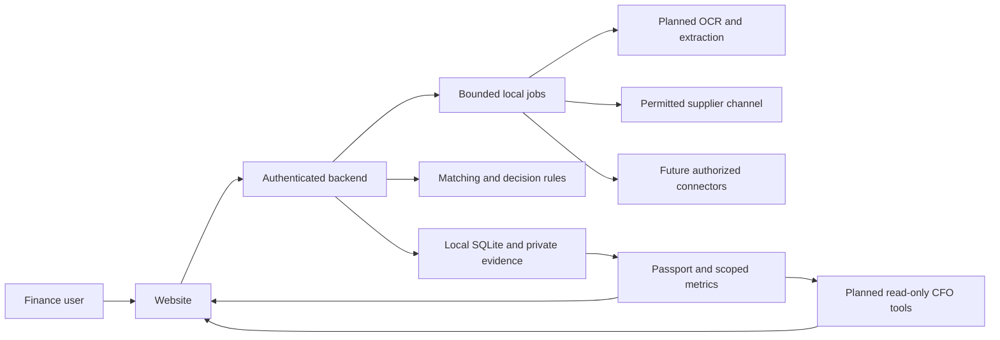

# GSTShield: the four-person product and judges guide

Prepared 6 October 2026. Current-code baseline: `04b2b42`, the saved Phase 13 checkpoint. This is a learning and presentation guide, not a claim that the proposed expansion is already implemented. Read [the research and expansion plan](09_FINANCIAL_COMMAND_CENTER_RESEARCH_AND_PLAN.md) for sources, all 36 proposed features, technical contracts and proposed Phases 15–24. The existing [build and verification ledger](05_BUILD_AND_VERIFICATION_PLAN.md) remains the record of completed work and pending verification.

## Problem statement

**Businesses struggle to keep supplier invoices, purchase orders, delivery evidence, GST observations, payment decisions and correction follow-ups connected. When these records are scattered or change at different times, finance teams must repeatedly check the same invoice, chase missing evidence and reconstruct why a decision was made. This can leave billing discrepancies, uncertain input credit and unresolved supplier issues unattended.**

**GSTShield's response:** give each invoice one continuing evidence-backed workflow: collect and validate the evidence, identify discrepancies, explain vendor context, route an accountable payment decision and follow the correction through to new evidence and recheck.

**Expanded demo:** Invoice upload → AI extraction → four-way reconciliation → vendor risk → payment decision → automated resolution.

The current website provides the GST comparison, review, cases, actions, payment proposals and reports foundation. The new research plan maps the additional modules needed to complete that expanded journey.

## 1. What we are building, in ordinary language

GSTShield helps a business follow a supplier invoice from evidence to a decision and then to resolution. A finance team should be able to see what it ordered, what arrived, what was billed, what the available GST evidence says, why an invoice needs attention, who should act and what actually changed afterward.

The existing website supplies the GST comparison, review, evidence, cases, action queue, payment proposals and reporting foundation. The expansion adds document extraction, purchase-order and receipt checking, a single Invoice Passport, vendor evidence profiles, payment-policy decisions, structured resolution automation and an executive assistant.

Our desired connected journey is:

**Invoice upload → AI extraction → four-way reconciliation → vendor risk → payment decision → automated resolution.**

The larger vision is an AI-powered Financial Command Center: the same verified financial and operational facts serve the CFO, CEO, COO, CTO, procurement team and eventually the CMO. These roles need different questions and, in some cases, new data. They should not receive six versions of the same chatbot.

### Three descriptions every teammate should know

| Description | When to use it |
|---|---|
| Today: a local website that retains GST evidence, compares files, records review and organizes invoice actions, cases and payment proposals | Explaining the implemented baseline |
| Expanded product: an evidence-backed financial firewall that checks an invoice before the payment decision and coordinates the correction afterward | Explaining the planned six-moment release |
| Long-term vision: a financial command center connecting supplier, compliance, payment and executive decisions | Explaining the broader roadmap |

A financial firewall is our product metaphor. Today’s payment proposals do not move money. The expanded internal policy can govern the application’s approval flow; actual enforcement at a bank requires an authorized payment integration and independent confirmation of payment status.

### Why somebody would use it

The user wants a usable answer to: “Which invoice needs attention, what evidence supports that, what should I do now, and how will I know it is resolved?” Keeping that answer connected across people, new evidence and later periods is the product’s everyday value.

A document summary is useful, but it does not by itself establish a permissioned company workflow. Our planned value is to attach analysis to saved evidence, assigned responsibility, controlled decisions, retries, rechecks and a trustworthy history. Modern AI agents can also perform actions through tools; our advantage must come from the reliability and convenience of this particular workflow.

## 2. Finance from zero: one example we all understand

### The purchase

Imagine your business buys goods from Supplier A:

| Component | Amount |
|---|---:|
| Price before GST | ₹100,000 |
| GST shown on the bill | ₹18,000 |
| Total bill | ₹118,000 |

The ₹118,000 is the invoice’s gross amount. The ₹18,000 is the recorded input GST. These are different measurements. Do not add them together and announce ₹136,000 protected.

Suppose, separately, the business has ₹25,000 of output GST on its own sales. In a deliberately simplified example, if the ₹18,000 input credit is legally available and usable, the cash portion of that output tax would be ₹25,000 − ₹18,000 = ₹7,000. If that credit needs review and cannot currently be used, the cash requirement may be higher. Actual returns involve more conditions, balances, categories and adjustments than this arithmetic example.

This is about GST input credit. An income-tax deduction is a different matter. GSTShield’s MSME payment cases can involve additional payment and tax considerations, but a GST mismatch is not automatically a duplicate income-tax charge.

### The supplier-side problem

Your purchase record contains this invoice. The uploaded supplier-derived GST evidence does not contain it, or contains different details. A reviewer needs to understand whether there is a timing difference, a data-entry mismatch, a supplier correction or a separate eligibility issue.

GSTR-2B is an input-credit statement derived from relevant supplier filings. Appearance in that statement is useful evidence; other conditions still affect eligibility. [GSTN GSTR-2B FAQ](https://tutorial.gst.gov.in/userguide/returns/FAQ_gstr2b.htm)

The product should show ₹18,000 of recorded tax associated with a missing-evidence issue, with the reason and source date. It should not turn that observation into a guarantee of permanent loss, automatic credit entitlement or recovered cash.

### How the expanded application handles it

1. The invoice arrives and its original document is retained.
2. Extraction proposes the supplier, invoice number, date, lines and amounts. A reviewer confirms uncertain fields.
3. The application compares the purchase order, receipt, invoice and available GST record.
4. The Passport explains: order and receipt are aligned; GST evidence is missing; recorded tax under review is ₹18,000.
5. The vendor profile shows whether similar issues recur and how much evidence supports the assessment.
6. The policy proposes an internal decision and explains conflicting obligations, including a relevant payment deadline.
7. A permitted vendor request asks for the specific correction or missing evidence.
8. A supplier promise is recorded but the issue stays open.
9. A new uploaded or authorized-fetched source arrives. The application links it to this invoice and runs the relevant checks again.
10. A reviewer sees what changed, whether a prior decision is stale and what can now be approved.

That is the difference between identifying a mismatch and completing an operational journey. It is our intended expanded behavior; several of these steps still require the new modules in the plan.

### What happens if credit was already reversed?

An original claim, a reversal and a later reclaim are separate events. The product must retain their periods, amounts and supporting observations. Later supplier evidence can trigger a review opportunity; it does not itself prove that a reclaim was filed or legally approved.

Rule 37 and Rule 37A address different situations. Buyer non-payment and supplier return-filing facts must not be collapsed into one generic clock. The applicable rule, dates and proportion need review. [Central Tax Notification 26/2022](https://gstcouncil.gov.in/sites/default/files/2024-05/ct26-2022.pdf)

The existing case models retain relevant facts. The expansion supplies more explicit cross-period relationships and continued re-evaluation when new evidence is received.

## 3. Documents and terms in the real workflow

| Item | Plain-language meaning | Why our application needs it |
|---|---|---|
| Purchase order, or PO | What the business agreed to buy | Check quantities, rates and expected delivery |
| Goods receipt, or GRN | Record of what the business actually received | Identify partial, excess or missing delivery |
| Service acceptance | Evidence that agreed work was accepted | Equivalent receipt evidence for a service invoice |
| Invoice | Supplier’s bill for the transaction | Identify amounts, lines and tax |
| Purchase register | Buyer’s recorded purchases | Starting point for the existing GST comparison |
| GSTR-1/IFF | Supplier outward-supply reporting sources relevant to the statement | Understand where supplier invoice observations originate |
| GSTR-2B | Recipient’s supplier-derived input-credit statement | Compare the tax evidence against recorded purchases |
| GSTR-3B | A return in which tax and credit are reported | Actual filed facts are distinct from our review recommendations |
| IMS | GST portal’s Invoice Management System | Recipient actions require an authorized portal workflow |
| IRN | Invoice Reference Number for an applicable e-invoice | Format, applicability and authenticity are separate checks |
| ITC | Input tax credit | Track recorded tax, review status and actual claim/reversal events |
| Udyam/MSME evidence | Information relevant to enterprise status | Determine whether payment-timing rules may apply |
| Credit note | A document adjusting an earlier invoice | Avoid treating a changed balance as an unrelated new invoice |
| Payment proof | Confirmation that a payment happened | Separate actual payment from a proposal or approval |

Four-way reconciliation in our product means **PO + receipt/service acceptance + invoice + GST evidence**. Always name the four sources. Other products may use “four-way” for a different combination, including inspection evidence. [Clear invoice-matching guide](https://www.clear.in/s/automated-invoice-matching)

For covered micro/small suppliers, MSMED timing depends on acceptance and agreement facts; it is not simply “45 days after every invoice.” Applicability and missing facts should be visible. [MSMED Act, India Code](https://www.indiacode.nic.in/bitstream/123456789/5872/1/a2006-27.pdf)

Any income-tax rule reference needs its applicable tax year. The Income Tax Department describes the April 2026 new-Act transition and treatment of earlier years. [Income Tax Department transition FAQ](https://www.incometax.gov.in/iec/foportal/help/all-topics/e-filing-services/objective-and-scope-new-act-faq)

## 4. The original problems and where they fit

| Original problem | Implemented foundation | Expanded connected behavior |
|---|---|---|
| Supplier omitted or misreported an invoice | Missing/mismatch results, review, retained actions | Extract invoice, explain evidence, request correction, recheck updated sources |
| MSME payment timing and financial risk | Classification, acceptance/payment facts, cases and payment proposals | Payment-policy conflict view, due-date escalation and controlled decisions |
| Previously reversed credit gets forgotten | Claim/reversal/supplier-filing observations in a case | Cross-period lifecycle, new-source trigger and reclaim-review queue |
| E-invoice/IRN concerns | Applicable facts and format review | Authorized authenticity checks, applicable reporting deadlines and source proof |
| Notices and scattered supporting evidence | Notice cases, histories and private PDFs | Evidence Vault and source-backed response assistance with review |
| Repeated manual checking and supplier follow-up | Saved comparison, action queue, reminders and channel groundwork | Structured resolutions, promises, SLA, escalations and correction rechecks |

The new features are additions to these problems, not a replacement with generic executive charts. PO and receipt evidence extend protection to commercial overbilling and premature payment. The shared invoice history lets that commercial evidence connect to the original GST and case work.

### “One upload and tracking” explained correctly

The original upload can be retained so the user does not have to re-explain the same history. The system still needs new evidence when the outside world changes. A new source can arrive through another upload, a supplier submission or a future authorized connector.

Today’s durable action identity is scoped to the saved source context. We have a foundation for detecting changed evidence, but not a universal cross-period identity that magically follows every unrelated import. The new plan explicitly adds links across invoice, source, claim, reversal and reclaim periods.

One-time intake reduces repetition. It does not eliminate the need for fresh data, and an offline PC cannot continuously read a government system.

## 5. What the existing website actually contains

The seven current internal sections are listed below. Use these names during the baseline demo. The larger dashboard, Passport and executive copilot are planned additions.

| Section | What a user does | What it produces |
|---|---|---|
| Sources | Imports supported structured files, maps fields and confirms a preview | A saved source with the selected workspace, registration and period |
| Reconciliation | Compares purchase evidence against available GST evidence and reviews suggestions | Saved matches, discrepancies, duplicates and review decisions |
| Cases & evidence | Records facts about a rule, payment concern, IRN or notice | A case history and supporting evidence |
| Work queue | Sees invoice actions, ownership/status and upcoming attention | Continued follow-up linked to saved context |
| Payment drafts | Builds and reviews allocation proposals | Internal proposed payment amounts and exports |
| Reports | Requests private evidence/report outputs | Downloadable records produced through bounded report jobs |
| WhatsApp | Manages supported local channel setup and permitted delivery workflow | Local integration states; live Meta/phone setup is still pending |

### Login and selected context

An account operates in an allowed workspace and a selected GST registration/period. The selection matters: the same invoice number can occur under different suppliers, businesses or periods. The server must apply the account’s scope rather than trusting a selected ID sent by the browser.

Keep the correct context visible in any demo. A meaningful comparison needs two compatible sources, not an arbitrary purchase file and another business’s GST file.

### A baseline demonstration that can use the existing modules

1. Log in with the local operator-created account and select the agreed synthetic workspace/registration/period.
2. Import a supported purchase file and GST evidence file through Sources; show the preview before confirmation.
3. Run reconciliation and open a clear discrepancy.
4. Show the recorded invoice/tax amount and source information.
5. Save a review or action with the existing permission model.
6. Open the corresponding work queue item and explain its continued state.
7. Show an appropriate case or payment proposal and its history.
8. Generate/download an evidence report if the current local runtime passes its focused smoke check.
9. Show WhatsApp as local integration groundwork unless real provider setup has been completed and verified.

This demonstrates the current foundation. It is not a demonstration of AI extraction, PO/receipt matching or an actual bank payment.

### Current verification status

The repository records checks through earlier phases and targeted Phase 13 checks. Phase 13’s provider setup is pending, its recorded browser run had an unresolved blank-page/startup failure, and the whole regression was stopped at the user’s request. Planning must not silently convert that checkpoint into a clean end-to-end acceptance.

No new tests or regression were run for these documents. Before a live demo or release, resolve the recorded failure and run the appropriate readiness checks. Phase 14 can wait during research; it is still necessary as a quality gate when we return to proving the application.

## 6. Walk through the six expanded moments

### Moment 1: Invoice upload

**What:** accept a supported PDF or image, store the original securely and associate it with the right business.

**Why:** finance users often receive documents rather than already-normalized rows.

**How:** bounded file validation, storage identity and a processing job. Keep the original document distinct from the extraction draft and the confirmed invoice.

**When:** on first intake or a later corrected invoice. A duplicate upload should not silently create a second payable.

**Visible proof:** original file, source identity, processing state and a link to the resulting draft/Passport.

**Failure handling:** unsupported, oversized, malformed or unreadable documents produce a useful error and retained retry context, not a made-up invoice.

### Moment 2: AI extraction

**What:** propose invoice fields and lines from the uploaded document.

**Why:** reduce repeated transcription while retaining evidence and human control.

**How:** text extraction for suitable PDFs, OCR for scanned content, then a typed extraction response. Each uncertain field has its source/page evidence and review state. Deterministic checks verify arithmetic and required structure.

**When:** after intake and again if the user supplies a corrected document or explicitly requests a supported retry.

**Visible proof:** the document beside extracted fields, uncertainty indicators and an editable confirmation step.

**Failure handling:** a bad image or model answer goes to review. A model cannot replace an unreadable GSTIN with a plausible fabricated value.

AI is useful here, but the current application does not yet have this module. Local candidates and evaluation gates are specified in the research plan; no model has been installed or benchmarked for the team’s laptop.

### Moment 3: Four-way reconciliation

**What:** compare order, receipt/acceptance, bill and available GST evidence.

**Why:** a bill can be tax-aligned while commercially wrong, or commercially valid while tax evidence is missing.

**How:** link the documents and allocate their lines. Calculate quantities, rates, amounts and tolerances using deterministic rules. Keep fuzzy-link suggestions as proposals that may need review.

**When:** after confirmed invoice intake, on a source refresh or after a material correction.

**Visible proof:** four source cards and separate findings. “Received 8, billed 10” is a receipt mismatch even if the tax amounts agree.

**Failure handling:** no receipt evidence means unknown/needs evidence, not automatically “goods were not delivered.” Partial deliveries, repeated receipts and credit notes must be handled explicitly.

### Moment 4: Vendor risk

**What:** show the supplier’s recorded issue pattern and a transparent policy assessment.

**Why:** the reviewer needs context for prioritization and repeated follow-up.

**How:** use measured coverage, known discrepancies, resolution delays and relevant verified facts. Show the scoring version, reasons and freshness. Unknown facts remain unknown.

**When:** when invoice or supplier evidence changes, and at defined refresh points.

**Visible proof:** the evidence behind a flag or trust score; the user can inspect the underlying invoices.

**Failure handling:** one imported invoice does not justify declaring a vendor fraudulent or universally risky. Missing history is low coverage, not a clean track record.

The plan uses an explainable trust score. A higher trust score and a higher risk score point in opposite directions; labels and thresholds must be consistent.

### Moment 5: Payment decision

**What:** propose PAY, REVIEW, HOLD or ESCALATE for the internal approval process.

**Why:** identified problems should affect an accountable decision rather than remain a passive chart.

**How:** a versioned policy evaluates commercial evidence, tax observations, due facts, known constraints and required approvals. It returns reasons, missing evidence and a proposed amount. Material source changes invalidate a stale decision.

**When:** before approving a proposal and when relevant evidence or policy changes.

**Visible proof:** amount, rule version, source version, reasons and named approval responsibility.

**Failure handling:** a tax discrepancy does not blindly override every payment obligation. A covered supplier deadline, dispute and missing evidence can require escalation. An internal PAY recommendation is not an actual payment or a blanket legal approval.

### Moment 6: Automated resolution

**What:** coordinate a specific request, response, evidence update and recheck until the issue has an established outcome.

**Why:** a detected problem has little value if nobody follows it through.

**How:** a durable resolution record connects the request, permitted channel attempt, supplier reply/promise, next deadline and new source. The new source triggers the relevant checks and a review when needed.

**When:** after an action is created; after a response, deadline or source change; and on restart catch-up.

**Visible proof:** “request queued,” “delivered,” “supplier promised,” “new evidence received,” “rechecked” and “review completed” are separate events.

**Failure handling:** delivery failure stays visible; uncertain delivery is not resent recklessly; a promise does not close the case; old evidence cannot satisfy a newer decision.

The external supplier and portal still control their own actions. Our automation coordinates, detects and evaluates updates; it does not guarantee that an unwilling supplier will correct a filing.

## 7. The Invoice Passport: why it connects everything

The Passport is a single invoice view with its original document, confirmed fields, all linked sources, commercial/GST findings, vendor context, case links, decisions, follow-ups and history.

Imagine opening INV-002 and immediately seeing: “₹118,000 gross; ₹18,000 recorded tax under review; receipt evidence complete; GST observation missing; supplier request due tomorrow; previous payment approval needs refresh because a source changed.”

That makes the application understandable. Without it, users must mentally connect seven separate screens. The Passport is the first proposed new build phase because later extraction, risk, payment and assistant features need the same coherent invoice identity and evidence view.

The Passport must show an as-of time and source versions. An old report may have been correct when produced; a new screen may reflect later evidence. The two should explain their dates rather than silently disagree.

## 8. Exactly what automation means here

| Trigger | Planned automatic work | What still requires somebody or an external system |
|---|---|---|
| New supported invoice document | Start extraction and deterministic validation | Confirm uncertain extracted fields |
| Confirmed invoice and linked sources | Recompute matching findings | Resolve ambiguous links or missing acceptance facts |
| Updated GST source | Recheck linked invoice evidence and invalidate stale decisions | Review applicable credit/return consequences |
| New supplier issue | Prepare the approved structured correction request | Consent, channel rules and appropriate sender approval |
| Supplier reply | Attach reply, detect promised date and prepare an update | Review ambiguous identity or unsupported statements |
| Promise/deadline passes | Escalate or remind within configured policy | Decide commercial action or approved exception |
| Corrected evidence arrives | Re-run checks and compare changes | Complete any required legal/payment review |
| New version of payment policy | Re-evaluate affected uncompleted decisions | Approve policy changes and material overrides |
| A reversal case gets new evidence | Create a reclaim-review opportunity | Determine eligibility and record actual filed outcome |
| CFO asks a question | Retrieve permitted metrics and source-backed explanation | Authorize any separate action through normal workflow |
| PC restarts | Catch up due local jobs with deduplication | Supply external connectivity/provider credentials |

### State distinctions to repeat during a demo

- A suggestion is not confirmed data.
- A matching observation is not legal entitlement.
- A payment proposal is not an executed payment.
- A queued request is not confirmed delivery.
- A supplier promise is not corrected evidence.
- New evidence is not an approved reclaim.
- A reviewed case is not necessarily a filed return.
- A historical snapshot is not a live government check.

These distinctions make automation accountable. They also help users understand precisely what changed and what still needs attention.

### What automatic fetching would add later

A permitted connector obtains fresh data from an external system, identifies the source and observation time, and passes it through the same validation and recheck path. It needs a supported integration, customer authorization and operational handling for failure or revoked access.

Current CSV uploads are manual data acquisition followed by application processing. Future automatic fetching replaces that acquisition step; it does not remove evidence review or make the underlying facts infallible.

### What automatic filing and payment would add later

Filing would submit an authorized, reviewed return or recipient action through a supported workflow and retain the external acknowledgement. Payment would initiate an approved transaction and reconcile the provider/bank result. Both need explicit permissions, idempotency and handling of uncertain results.

A PDF, portal recommendation or payment export does not establish either external effect. These integrations are retained in the broader roadmap, after the internal six-moment workflow.

## 9. A plain architecture explanation

The browser is the website. The Python backend checks requests, permissions and workflow rules. SQLite stores the local account, evidence, action and history data. Bounded workers process heavier tasks outside critical database locks. External providers are adapters with clear states, not the source of every business rule.

### The difference between AI and rules

| Task | AI contribution | Deterministic application responsibility |
|---|---|---|
| Read a difficult invoice | Suggest fields from document evidence | Validate types, money totals, required facts and permissions |
| Connect slightly different invoice text | Suggest a likely relationship | Enforce scope, identity rules and required confirmation |
| Explain an invoice issue | Summarize retrieved sources | Supply accurate records and source identifiers |
| Answer a CFO question | Interpret intent and explain retrieved metrics | Compute metrics and filter permitted data |
| Decide payment approval | Explain the policy result | Evaluate rules and enforce approval authority |
| Submit a filing or transfer | No independent authority | Separate approved connector workflow with acknowledgements |

A prompt inside a supplier PDF is document content. It cannot authorize an action, override the company’s policy or request another customer’s records. Extraction and assistant tools must retain that boundary.

### Why local storage is appropriate for the selected setup

The team selected a local PC deployment for the hackathon. SQLite is an actual database stored on that PC, not browser localStorage. It retains application state without choosing a paid or external database service.

The backend still needs to run. The laptop must be awake for real-time processing and delivery. An internet-facing WhatsApp callback also needs a reachable HTTPS route and provider setup. Storing records locally does not mean that internet-dependent actions can happen while the laptop is sleeping.

The friend's PostgreSQL architecture is a future design option, not a reason to migrate the existing data now. This expansion plan deliberately reuses the current application foundation.

## 10. How we explain the USP and competitors

### The USP we should build and prove

**A single evidence-backed invoice journey that connects commercial checks, GST review, payment decisions and supplier resolution, with every amount and next step traceable.**

Our strongest demonstration is an invoice changing state because of real new evidence: the Passport updates, the vendor profile reflects it, an obsolete approval is invalidated, a correction request has its own delivery/promise state, and the resulting decision can be explained from the saved sources.

Candidate differentiators are the coherent Passport, explicit conflicting-obligation handling, evidence-based resolution, useful executive tools, low-friction local deployment and cross-period memory. They are product bets to demonstrate and compare with customers. They are not yet independently established market exclusives.

### Know the category

| Competitor/category | Documented overlap | Useful question for our product |
|---|---|---|
| Clear GST / finance platform | Reconciliation, carried-forward pending ITC, invoice history, supplier follow-up and broader compliance/finance workflows | Can our intended user understand and act on one invoice with less setup and screen switching? |
| TallyPrime | Accounting-connected GST reconciliation and IMS workflows | Can a team using its ledger gain a clearer exception-to-resolution layer from our product? |
| Zoho Books | Document capture and IMS recipient workflows | Can our linked commercial/tax decisions and resolution evidence improve this user’s actual process? |
| IRIS/Sovos and Masters India | GST/e-invoice and compliance integration offerings | Which supported connectors should we reuse rather than rebuild? |
| SAP procurement/AP | Order/receipt/invoice matching and enterprise controls | Can we deliver a focused, understandable package for a smaller finance team? |

Source links: [Clear reconciliation guide](https://docs.cleartax.in/product-help-and-support/clear-finance-cloud/gst-compliance/gstr-2b-vs-pr-recon), [Clear finance workflows](https://www.clear.in/fmcg-solutions), [Tally GST reconciliation](https://help.tallysolutions.com/gstr-2b-reconciliation/), [Tally IMS](https://help.tallysolutions.com/ims-faq/), [Zoho IMS](https://www.zoho.com/in/books/help/gst/ims.html), [Zoho document capture](https://www.zoho.com/en-de/books/help/documents/documents.html), [Sovos India](https://sovos.com/in/), [Masters India documentation](https://docs.mastersindia.co/masters-india-gst-software), [SAP receiving](https://learning.sap.com/courses/receiving-purchase-orders-in-sap-ariba-buying-and-invoicing/evaluating-optional-receiving-features).

A customer may currently use software, spreadsheets, email, WhatsApp and accountant review together. Manual coordination can persist inside an otherwise automated software stack. We should interview people about the remaining work rather than assume the entire process is manual.

### A useful answer to “Why not Clear or Tally?”

“They already solve important parts of this category. Our focus is a connected invoice decision and resolution workspace: source evidence, commercial and tax findings, the payment-policy reason, responsibility, correction and recheck in one story. We plan to complement existing ledgers and validate that experience with finance teams.”

Then demonstrate the story. Do not depend on claiming that another company lacks a feature we have not tested.

### A useful answer to “Can AI do this?”

“AI can help read documents, answer questions and even call tools. We are building the company workflow around those abilities: scoped evidence, deterministic amounts, versioned policy, approvals, durable actions, external receipts and outcomes. The assistant should make that workflow easier to use.”

### What would count as proof of value?

Measure intake/review time, time to identify the next action, unresolved age, repeat requests, evidence-complete resolutions, accuracy of money totals and user ability to explain a decision. Compare equivalent tasks against the customer’s current process. Customer interviews, competitor product trials and local model benchmarks remain work to perform; they were not fabricated for this guide.

## 11. Demo data everyone should recognize

Use clearly labeled synthetic data. Do not put a real person’s private invoice, phone number, supplier bank account or tax identifier on the presentation screen.

| Invoice | Purpose | Expected visible story |
|---|---|---|
| INV-001 | Clean control: ₹50,000 base + ₹9,000 GST = ₹59,000 gross | Evidence aligned; shows normal handling |
| INV-002 | ₹100,000 base + ₹18,000 GST = ₹118,000 gross; GST observation initially missing | ₹18,000 recorded tax under review, correction request, new evidence and recheck |
| INV-003 | Similar invoice reference with a formatting difference | Candidate relationship needs appropriate confirmation |
| INV-004 | Ordered 10, received 8, billed 10 | Partial-receipt commercial discrepancy |
| INV-005 | Duplicate-related example | Duplicate identity/allocation handled without a second payable |
| INV-006 | Covered-supplier timing case with explicit acceptance/agreement facts | Competing obligation and escalation, rather than a blind indefinite hold |

Do not sum the recorded GST for a duplicate twice. Do not claim that a paid or approved amount is “saved.” The app should display separate measures with definitions: recorded tax under review, invoice gross under a policy state, pending proposed amount, evidenced payments and actually established credit events.

For INV-002, the supplier saying “I will fix it tomorrow” changes the promise record. A later source observation changes the tax-evidence record. A completed review changes the decision. That is three different kinds of progress and the audience should see all three.

## 12. Two demo scripts: current foundation and expanded release

### Script A: current foundation, approximately three minutes

This is a suggested rehearsal, not an official event time allowance. Use it only after the current startup issue and readiness checks have been resolved.

| Time | Screen/action | What to say |
|---|---|---|
| 0:00–0:25 | Login and selected business/period | “This is the business context. Every result and action is tied to it.” |
| 0:25–0:55 | Sources: purchase and GST preview/confirmation | “We retain structured evidence and validate it before comparison.” |
| 0:55–1:30 | Reconciliation discrepancy | “This invoice has a recorded tax amount needing review. Here are the source observations.” |
| 1:30–2:00 | Work queue/action history | “The issue keeps its context, owner and next action.” |
| 2:00–2:30 | Relevant case/payment draft | “This is a documented case or an internal payment proposal, with review history.” |
| 2:30–3:00 | Report and roadmap | “The evidence can be retained/exported. Our expansion connects intake, commercial checks, policy decisions and resolution.” |

Do not add a fake AI animation, pretend to have fetched GST data or use an unconfigured phone as live WhatsApp proof. If a report or provider step is pending, show its documented state and continue with the verified local workflow.

### Script B: target expanded six-moment release, approximately seven minutes

Run this when the new modules and connected acceptance actually exist. The sequence is designed to make the financial firewall visible, rather than spending the whole demo on dashboards.

| Time | Moment | Demonstration and message |
|---|---|---|
| 0:00–0:35 | Problem and context | “A supplier invoice crosses procurement, tax and finance. Here is one ₹118,000 bill and its ₹18,000 recorded GST.” |
| 0:35–1:20 | Upload → extraction | Upload a synthetic document. Show original, extracted fields and review/confirmation. “AI proposes; evidence and validation remain visible.” |
| 1:20–2:20 | Four-way reconciliation | Show PO, receipt, invoice and GST cards. “Commercial evidence and tax evidence produce separate findings.” |
| 2:20–2:55 | Vendor context | Open the profile and drivers. “This assessment explains its evidence and coverage.” |
| 2:55–3:50 | Payment decision | Show versioned policy and a relevant conflict. “The controller receives a reasoned internal decision, not a mysterious score.” |
| 3:50–5:35 | Automated resolution | Create the approved request, record a promise, supply clearly labeled corrected evidence through supported intake and show recheck. “The issue changes when the evidence changes.” |
| 5:35–6:25 | Executive view | Ask a source-backed CFO question about the remaining exposure and drill down to invoices. “The answer uses the same metrics as the screen.” |
| 6:25–7:00 | Outcome and next step | Show the history, pending responsibilities and later connector path. “This is an accountable financial workflow from invoice to resolution.” |

If a provider is unavailable, clearly label its simulator. The correction must enter through the supported interface or test adapter; do not secretly edit the database during the demo. A simulator proves our local workflow transition, while real delivery/portal authenticity remains separately conditional.

### Presenter handoffs

- Person 1 introduces the buyer problem and INV-002 amounts.
- Person 2 handles intake, extraction and four-source findings.
- Person 3 handles policy conflict and resolution history.
- Person 4 handles executive questions, architecture, measured proof and roadmap.

Keep one person driving the keyboard throughout if handoffs make the demo slower. Each teammate must still be able to explain the whole invoice journey.

### A fallback plan

Have a supported synthetic dataset, a known workspace, a recorded as-of date and an offline evidence report prepared. If inference or connectivity fails, show the retained evidence and current state. Explain which step failed and which core workflows remain usable. A recording can illustrate a previously verified result only if its date and status are disclosed; it does not become proof that the current live run succeeded.

## 13. Pitches we can actually defend

### Thirty seconds: current product

“GSTShield is a local finance website that keeps purchase and GST evidence, comparison results, review history and invoice follow-up together. It helps users identify an invoice needing attention, understand the recorded amount and retain the next action or case. We are expanding this into a connected commercial, tax and payment-decision workflow.”

### Thirty seconds: expanded product

“GSTShield is an evidence-backed financial firewall between a business’s suppliers and its payment process. It reads an invoice, compares the order, receipt, bill and GST evidence, explains vendor context, proposes a controlled payment decision and follows the correction until new evidence can be rechecked.”

### Ninety seconds: the full story

“A finance team can have an invoice in its books, delivery evidence somewhere else, a supplier GST problem in a portal export and a correction promise in WhatsApp. The difficulty is keeping the decision current across all those pieces.

“Our product connects those pieces into one Invoice Passport. AI helps extract and explain documents. Deterministic checks calculate amounts and matching findings. A policy explains whether the internal payment decision is ready, needs review or needs escalation. The resolution workflow retains the request, supplier promise, deadline and corrected evidence; it rechecks the invoice instead of assuming a message fixed it.

“The same records power a source-backed CFO view. The existing application already supplies imports, GST comparison, cases, proposals, actions and reports. The next release adds the complete six-moment journey, then authorized connectors and broader executive intelligence. Our value is a reliable, understandable path from evidence to action and resolution.”

Use the current-product pitch when presenting the baseline. Use the expanded-product pitch for the planned product or an implementation that has actually passed its connected acceptance.

## 14. What GrowthOS adds for each role

| Role | Useful questions | Required evidence and boundary |
|---|---|---|
| CFO | Which invoices need cash/credit attention? What can be proposed for payment? Why did exposure change? | Exact amounts, due facts, source versions and approval states |
| CEO | Where is supplier concentration? Which issues threaten operations or require escalation? | Permitted organization-level metrics; decision drilldown |
| COO | Which deliveries/acceptances are incomplete? What blocks a supplier resolution? | PO/receipt facts, owners, promises and operational dates |
| CTO | Are jobs failing, sources stale or connectors unavailable? | Real health, error, latency and queue-age telemetry |
| Procurement | Which suppliers repeatedly miss deliveries or corrections? | Evidence-based vendor/receipt history; approved sourcing inputs |
| Tax/compliance reviewer | What supports this discrepancy, reversal or draft notice response? | Case facts, policy sources, observations and reviewer authority |
| CMO | Which campaigns produce useful revenue/margin? | CRM, sales, campaign spend and attribution data; purchase GST alone is insufficient |

The CFO starts first because its tools can reuse the invoice and workflow data. CEO/COO/procurement views extend that same operational base. CMO functionality needs new data contracts before it can provide credible answers.

A financial digital twin is an assumption-labeled scenario model. For example, it can show a cashflow scenario using real cash, due and expected receipt inputs. Without those inputs, a polished prediction chart is only a demonstration scenario. Data coverage and assumptions must remain visible.

## 15. Four-person learning and implementation ownership

### Shared learning: approximately ninety minutes

This is a team suggestion. Adjust it to the available time; do not confuse reading time with implementation estimates.

1. First 20 minutes: everyone reads sections 1–5 and independently explains the ₹118,000 invoice example.
2. Next 20 minutes: walk the existing seven screens together using synthetic data; list any unclear state or failed transition.
3. Next 20 minutes: read sections 6–9 and explain all six moments without relying on AI-generated wording.
4. Next 15 minutes: rehearse the competitor/USP answer and identify what we must still demonstrate.
5. Final 15 minutes: do the quiz and rehearse handoffs. Someone asks unexpected “what if” questions.

### Ownership with shared understanding

| Person | Primary ownership | Must explain to the others |
|---|---|---|
| 1: Domain/backend | Invoice identity, amounts, scope, schema relationships and deterministic findings | Why the same invoice is linked correctly and totals are trustworthy |
| 2: Workflow/integration | Policy, resolution, outbox, provider states and approvals | What happens after a failed delivery, promise or uncertain external result |
| 3: Frontend/product | Passport, dashboard, intake/review, context changes and accessibility | How a user knows what changed and what action is next |
| 4: AI/data/demo | Extraction evaluation, scoped assistant, synthetic scenarios and evidence | What AI does, how uncertainty is handled and what was actually measured |

Before merging related work, agree on the source identity, exact-money representation, version fields, request/result DTO and failure states. Those shared contracts prevent frontend/backend alignment from becoming an afterthought.

### A handoff is complete when

- The recipient can find the relevant document, module and workflow state.
- The expected request/response and permissions are clear.
- One happy path and one failure/change path are demonstrated.
- A material unresolved condition is recorded, not silently passed onward.
- Both people can explain how the module connects to the preceding invoice evidence and next decision.

## 16. Judge questions and short, accurate answers

### Product and business

**1. What problem are you solving?**

Finance teams need to connect supplier evidence, GST review, commercial acceptance, payment decisions and follow-up. We give an invoice a continuing evidence-backed workflow instead of losing the context between those steps.

**2. Who is the first user?**

An SME accounts/tax/AP reviewer. A controller, owner or CFO approves material decisions. Procurement and operations contribute receipt and acceptance evidence.

**3. Are you replacing accounting software?**

Our first target is a decision and resolution layer that can use supported exports and later authorized connectors. A full ledger replacement would add a different product scope.

**4. Is the pain validated?**

The underlying compliance and invoice-control processes are documented. Our research identifies workflow hypotheses; customer interviews are still needed to measure frequency, willingness to pay and fit.

**5. What is the differentiator?**

The coherent invoice story: source-backed findings, a transparent internal decision, accountable resolution and executive drilldown. We will prove convenience and reliability against the customer’s existing process.

**6. Do competitors already automate this category?**

Yes, important parts and broad finance workflows are documented. Our target experience must be compared on equivalent workflows, rather than described as universally unique.

**7. Why will a customer use your product beside a ledger?**

If it reduces the work of finding the next action, coordinating corrections and checking whether the decision remains current. That value is measurable through a pilot.

**8. What has actually been built?**

Structured imports, GST comparison/review, retained actions, cases, payment proposals, reports, internal screens and local WhatsApp integration groundwork. The research plan labels the extraction, four-way, risk, policy and assistant additions.

### Finance and decisions

**9. Does a missing GST observation mean the customer lost ₹18,000?**

It establishes a recorded-tax issue needing review from the available source. Timing, corrections and eligibility conditions affect the final outcome.

**10. Does a matching invoice mean credit is legally approved?**

It establishes a matching observation. The relevant legal and factual conditions still require the appropriate review.

**11. Why show the invoice gross and tax separately?**

They measure different things and overlap. Adding them together can double count money and misstate the outcome.

**12. What are the four ways?**

Purchase order, receipt/service acceptance, invoice and available GST evidence. We show a result for each dimension.

**13. What if only eight of ten units arrived?**

The commercial check needs a partial-receipt allocation and a quantity finding. It should not assume either that the full bill is approved or that no delivery occurred.

**14. What if no purchase order exists?**

Show the missing dimension and the company’s applicable review policy. A non-PO invoice can follow an explicitly defined approval route.

**15. What if tax evidence is missing but an MSME payment deadline is approaching?**

Show both findings, applicability and known facts. The planned policy can escalate the conflict for an authorized decision instead of blindly imposing a tax-based hold.

**16. Does PAY mean the bank transferred the money?**

It is an internal policy/proposal state. Actual execution and confirmation require the later approved payment connector.

**17. How do you recover forgotten credit?**

Retain original claim, reversal and later observations, link new evidence and create a reclaim-review opportunity. Record an actual filed reclaim only with the relevant evidence; do not guarantee recovery.

**18. Can you verify an IRN now?**

The existing code records applicability and format facts. Government authenticity verification requires a trusted authorized integration.

### AI, automation and failure

**19. Why is AI needed?**

It can reduce document transcription and make evidence easier to question and explain. The workflow still uses typed confirmation, deterministic calculations and normal permissions.

**20. What if the model hallucinates a field?**

Retain the original/page evidence, validate the proposed result and route uncertainty to review. Unreadable content stays uncertain.

**21. Can a supplier PDF tell the AI to approve a payment?**

It is untrusted input. It cannot grant permission or change the policy/approval workflow; the backend enforces those boundaries.

**22. Does sending a WhatsApp message resolve the case?**

Delivery, supplier promise, corrected evidence and reviewed resolution are separate states. A message alone changes only the communication state.

**23. What if the supplier never replies?**

Keep the issue open and follow the configured deadline/escalation policy. The application can coordinate responsibility; it cannot guarantee the supplier’s cooperation.

**24. How do you avoid repeated messages after a timeout?**

Use a durable attempt/outbox record and distinguish known failure from uncertain delivery. Reconcile the provider state where supported before repeating an uncertain effect.

**25. Is WhatsApp live?**

Local integration code and targeted checks are recorded. Meta setup, reachable HTTPS callback and real phone/provider proof remain pending until actually completed.

**26. Does “continuous” work while the PC is asleep?**

The local service processes events while running and catches up permitted due work after restart. Real-time external behavior needs the machine, network and provider connection available.

### Architecture, quality and next steps

**27. Where is the data stored?**

In private local SQLite and associated local evidence/artifacts under the selected deployment. Browser selection state is not the authoritative financial store.

**28. Can one user access another business by changing an ID?**

The backend must check live account membership and permitted scope on each operation. New modules reuse that boundary and need cross-scope acceptance checks.

**29. What happens when a source changes after approval?**

The planned policy records source/rule versions. A material change invalidates the old decision and requires a fresh applicable review.

**30. How do you know it is correct?**

Use exact-money invariants, source/version checks and meaningful targeted/integration tests. The baseline still has recorded pending readiness checks; no new regression was run for this research.

**31. Why not migrate to PostgreSQL now?**

The selected local setup already has SQLite and retained data. New modules can extend it with explicit upgrades; a deployment-scale change should follow a demonstrated need.

**32. What is the next phase?**

The proposed Phase 15 exposes the Invoice Passport and coherent baseline metrics. Later phases add extraction, four-way checks, vendor intelligence, decisions, resolution and the CFO assistant.

**33. Will automatic filing be included?**

It is retained in the later authorized connector roadmap. The internal six-moment workflow comes first; real filing requires supported authorization and submission acknowledgements.

**34. What does the CMO agent do with the current data?**

Purchase and GST evidence cannot establish campaign ROI. The CMO module needs sales, CRM, spend and attribution data before it can answer those questions credibly.

**35. Do you have zero bugs or production-level assurance?**

We can describe specific design protections and recorded checks. Assurance comes from demonstrated workflows and relevant testing, not line count or a universal guarantee.

**36. How was the system created and what did each person contribute?**

Explain the actual development history, AI/third-party assistance and each teammate’s work. Keep technical evidence available. Submission administration is a separate task; planning does not change provenance.

## 17. A glossary for quick revision

| Word | Meaning in our discussions |
|---|---|
| Evidence | A retained source supporting an observation or decision |
| Provenance | Where the evidence came from and how it was obtained |
| Observation | What a source showed at a particular time |
| As-of time | The time/date represented by a snapshot |
| Canonical invoice | The application’s normalized invoice identity and facts |
| Extraction draft | Proposed fields that still need validation/confirmation |
| Reconciliation | Comparing related records and identifying agreement or differences |
| Fuzzy candidate | A possible relationship based on similar text or fields |
| Allocation | Assigning quantities/amounts to related document lines or proposals |
| Exception | A finding that needs an additional decision or evidence |
| Policy | Versioned company rules for evaluating a workflow |
| Override | An authorized, reasoned exception to a policy outcome |
| Maker/checker | Separate creation and approval responsibilities where required |
| Source signature | A way to identify the evidence version behind a result |
| Stale approval | Approval based on material facts that have since changed |
| Outbox | A durable record of a planned external effect and its delivery progress |
| Idempotency | Repeating the same request does not create another logical effect |
| Unknown result | The external outcome cannot yet be established safely |
| SLA | Agreed expectation for an action or response time |
| Resolution | A workflow outcome supported by the required evidence and review |
| Reversal | Recorded removal/adjustment of a previously claimed credit |
| Reclaim/re-avail | A later credit event subject to applicable conditions |
| Tenant/workspace | The company/account boundary for permitted records |
| DTO/contract | The agreed request/response shape between client and server |
| Projection | A readable view assembled from authoritative stored records |
| Regression | Checking that established behavior still works after changes |
| Connector | A supported adapter to another system |
| Copilot | An assistant using permitted tools and evidence |
| Telemetry | Measured operational events, delays and outcomes |
| Digital twin | An assumption-based scenario representation using defined inputs |

## 18. Check that all four people understand

Discuss these without looking up the answer first.

1. An invoice shows ₹100,000 base and ₹18,000 GST. What is the gross? Which amount belongs in a recorded-tax review metric?
2. The supplier promises to correct the invoice tomorrow. Which state changes? Which state remains open?
3. A new GST source matches the invoice. What must happen to a decision based on the old source?
4. Name our four evidence groups. What should missing receipt evidence mean?
5. Why can a covered-supplier due concern conflict with a tax-related hold?
6. Does an approved payment draft establish that money left the bank?
7. What additional data does a CMO answer about campaign ROI need?
8. What can the assistant do if a user asks about another workspace?
9. How does a document summary differ from a durable invoice workflow?
10. Which proposed phase gives the current invoice its coherent home?
11. What is still required before showing live WhatsApp or automatic GST fetching?
12. What is the strongest evidence that our resolution workflow is useful?

### Answer key

1. ₹118,000 gross; ₹18,000 recorded tax. Keep the measures separate and define the review category.
2. Record the promise and next action. Correction/resolution stays open until suitable evidence and review.
3. Link the new observation, re-run relevant checks and invalidate or refresh affected stale decisions through the controlled workflow.
4. PO, receipt/service acceptance, invoice, GST evidence. Missing receipt means unknown/needs evidence under the applicable policy.
5. Different legal/commercial obligations can coexist; show applicable facts and route the conflict for an authorized decision.
6. No. Actual payment needs independent execution/confirmation evidence.
7. Sales, CRM, campaign spend and attribution, with relevant permissions and definitions.
8. Deny or restrict the request to the account’s permitted live scope; the model cannot grant access.
9. The workflow retains identity, versions, responsibility, approval and outcomes as evidence changes.
10. Phase 15: Invoice Passport and coherent baseline dashboard.
11. Provider account/authorization, credentials, callback/connectivity, supported contract and real-provider proof.
12. A retained invoice changes through request, response/new evidence, recheck and reviewed outcome, with accurate amounts and an inspectable history.

## 19. What to ask a finance reviewer before making legal claims

| Question | We can establish from code/data | Additional expertise/evidence needed |
|---|---|---|
| Do two recorded amounts match? | Deterministic comparison of supported source fields | Interpret why a mismatch matters commercially or legally |
| Is the GST observation absent from this source? | Search within the validated source and context | Determine timing, eligibility and next return action |
| Which date starts this supplier payment clock? | Retain acceptance/agreement/payment facts | Confirm applicability and treatment of disputes or missing facts |
| Is a Rule 37/37A event applicable? | Evaluate explicitly recorded facts under a versioned rule | Review legally relevant conditions and actual return consequences |
| Is this vendor’s IRN authentic? | Format/applicability checks | Trusted registry/provider observation with proper authority |
| Was tax or a payment actually submitted? | Store a supplied/connector receipt | Establish the external result and reconcile uncertainty |
| Can a notice response be filed? | Assemble relevant evidence and draft assistance | Authorized reviewer and supported submission workflow |

A teammate does not need to become a tax specialist to explain the software. They do need to distinguish recorded facts, rule evaluation, professional review and actual external outcomes.

## 20. Reading and next action

1. Use this guide to establish common understanding and rehearse the current invoice journey.
2. Use [the detailed expansion plan](09_FINANCIAL_COMMAND_CENTER_RESEARCH_AND_PLAN.md) to choose the next implementation slice and its acceptance.
3. Preserve the existing [build ledger](05_BUILD_AND_VERIFICATION_PLAN.md) and its actual Phase 13/14 status; these new documents do not mark new code complete.
4. When coding resumes, begin the proposed Phase 15 Passport foundation and keep the six-moment contracts aligned.
5. Before a release/demo, complete appropriate readiness verification, including the recorded startup/browser issue. No regression was run in this document task.

The full financial-firewall and executive-command-center vision is retained. This guide gives the team a concrete invoice, vocabulary, state model, architecture, demo and answers to explain that vision while knowing what exists and what the next work adds.
